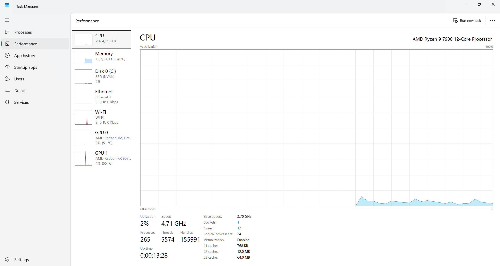
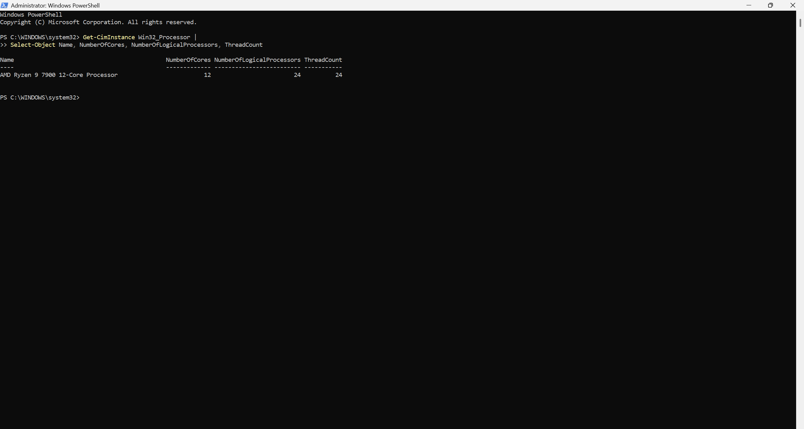

# Chapter 0 — Project Scope, Hardware Audit, and Repository Setup

## Objective

Establish the real constraints of the homelab before choosing the architecture. This chapter records the available desktop hardware, Windows environment, network access, and the design decisions that follow from those facts.

## Business Scenario

The lab will simulate the infrastructure of a small organization with multiple user groups, centralized services, segmented networking, security controls, monitoring, backup, and later automation/cloud integration.

The environment should be realistic enough to demonstrate junior system administration, network engineering, cloud, and DevOps skills while remaining practical on one physical workstation.

## Core Lab Constraint

The entire lab will be operated from a **single Windows desktop**.

The desktop will serve two roles:

1. **Physical administrator workstation** — the normal Windows environment used to manage, test, document, and troubleshoot the lab.
2. **Lab compute host** — virtual machines and network simulation/emulation tools will provide the servers, clients, firewalls, routers, switches, and other infrastructure required by later chapters.

The separate laptop is intentionally excluded from the required architecture so the project remains convenient to reproduce and operate from one machine. It may only be used later as an optional extension if there is a clear engineering reason.

## Planned Logical Model

```text
Physical Windows 11 Pro Desktop
│
├── Administrator workstation / browser / terminal / Git
│
├── Hyper-V
│   ├── Windows Server VM(s)
│   ├── Windows client VM(s)
│   ├── Linux server VM(s)
│   ├── Firewall/router VM
│   └── Monitoring/utility VM(s)
│
└── Network lab tooling
    └── GNS3 / GNS3 VM on Hyper-V as required
```

## Chapter 0 Tasks

- [x] Record desktop hardware and reported Windows edition
- [x] Record available network interfaces
- [x] Verify exact Windows build/version
- [x] Identify why the CPU exposed only 12 logical processors although the installed model supports 24 threads
- [x] Re-enable SMT in Ryzen Master and verify that Windows exposes 24 logical processors
- [x] Identify the currently active Windows virtualization state
- [x] Confirm hardware virtualization support is enabled in firmware
- [x] Define the physical-host strategy: single desktop
- [x] Choose the virtualization platform: Hyper-V
- [x] Choose planned network simulation/emulation tooling: GNS3 with Hyper-V support
- [x] Define the first architecture diagram
- [x] Define naming conventions
- [x] Define an initial IP addressing plan
- [x] Record final Chapter 0 engineering decisions

## Hardware Inventory

### Desktop

Initial PowerShell audit performed on 2026-08-12 and completed on 2026-08-13.

| Component | Observed value |
|---|---|
| Manufacturer | Micro-Star International Co., Ltd. |
| Motherboard | MSI B650 GAMING PLUS WIFI (MS-7E26), revision 1.0 |
| BIOS | American Megatrends / MSI BIOS 1.L0, dated 2025-06-19 |
| CPU | AMD Ryzen 9 7900 12-Core Processor |
| Physical CPU cores | 12 |
| Logical processors exposed to Windows | 24 — verified after SMT restoration |
| CPU hardware thread count | 24 |
| RAM | 31.1 GB usable/reportable |
| Storage | SPCC M.2 PCIe SSD, 953.87 GB |
| Architecture | 64-bit |
| Firmware virtualization | Enabled |
| BIOS SMT Control | Auto |
| Ryzen Master SMT state | ON after remediation |
| Windows edition | Windows 11 Pro |
| Windows release/build | 25H2, build 26200.8973 |

The Ryzen 9 7900 originally appeared in Windows as 12 cores and 12 logical processors while WMI still reported `ThreadCount = 24`. No Windows `numproc` boot limit was present and BIOS `SMT Control` was set to `Auto`.

AMD Ryzen Master was then inspected and showed `Simultaneous Multithreading = OFF`. SMT was changed to `ON` in Ryzen Master and applied. After restart, Windows correctly reported 12 cores, 24 logical processors, and 24 threads.

This resolved the host CPU-capacity anomaly before the virtualization chapter began.

### Installed CPU / Platform Utilities Relevant to Investigation

The Windows software inventory identified:

- AMD Ryzen Master 2.14.2.3341
- AMD Ryzen Master SDK 3.0.0.3620
- MSI Center SDK 3.2026.0410.01

Ryzen Master was the relevant control point for the logical-processor issue.

### Additional Physical Hardware

Not required for the core project.

## Network Environment

Observed adapters during the initial audit:

| Adapter | State | Observed link speed / purpose |
|---|---|---|
| RZ616 Wi-Fi 6E 160MHz | Up | 144.4 Mbps; current host connectivity |
| Realtek Gaming 2.5GbE | Disconnected | Physical 2.5 GbE Ethernet adapter |
| Tailscale Tunnel | Up | Overlay/VPN adapter |
| VirtualBox Host-Only Ethernet Adapter | Up | 1 Gbps virtual host-only adapter |
| Additional VirtualBox Host-Only adapter | Not present | Stale/unused virtual adapter |

The VirtualBox adapters indicate a previous virtualization installation. They are not part of the planned final architecture and can be reviewed later if cleanup becomes useful.

## Current Windows Virtualization State

Verified from an elevated PowerShell session on 2026-08-12:

| Feature / setting | State |
|---|---|
| Microsoft-Hyper-V-All | Disabled |
| VirtualMachinePlatform | Enabled |
| HypervisorPlatform | Disabled |
| `hypervisorlaunchtype` | Auto |
| Virtualization-Based Security | Enabled and running |
| Memory Integrity / HVCI | Configured and running |

The Windows hypervisor is therefore already active for host security features even though the full Hyper-V VM-management feature has not yet been enabled.

## Design Decisions

### DD-001 — Single-desktop lab

**Decision:** All required project work will run from one Windows desktop using virtualization and, where useful, network simulation/emulation.

**Reasoning:** This removes the operational friction of moving between physical machines while still allowing realistic isolated servers, clients, firewalls, and network topologies to be built and tested.

### DD-002 — Preserve the current Windows security baseline

**Decision:** Keep the host's current VBS/Memory Integrity security baseline while building the lab.

**Reasoning:** The lab should demonstrate sensible infrastructure practice on the everyday workstation rather than weakening the host merely to accommodate a different virtualization stack.

### DD-003 — Hyper-V as the primary desktop hypervisor

**Decision:** Use Microsoft Hyper-V as the primary virtualization platform.

**Reasoning:** The host runs Windows 11 Pro, virtualization is enabled, the Microsoft hypervisor is already active for Windows security features, and Hyper-V integrates naturally with Windows administration and PowerShell. Current GNS3 releases also provide a Hyper-V-compatible GNS3 VM.

**Consequence:** Chapter 1 will enable and validate the full Hyper-V feature, establish VM storage conventions, create virtual networking, and deploy a small test VM before the enterprise services are built.

### DD-004 — GNS3 for advanced network emulation

**Decision:** Add GNS3 later when router/switch appliance emulation and larger network topologies become useful.

**Reasoning:** Hyper-V will host the main server/client infrastructure; GNS3 adds dedicated network-engineering capabilities without requiring a second physical machine.

### DD-005 — Restore full CPU thread capacity before virtualization

**Decision:** Resolve the 12-logical-processor anomaly before deploying the lab.

**Reasoning:** The host is the only physical compute platform for the project. Confirming and restoring the expected 24 logical processors prevents unnecessary CPU contention and demonstrates proper pre-deployment troubleshooting rather than designing around an unexplained constraint.

### DD-006 — Segmented lab architecture behind FW01

**Decision:** Use separate USERS, SERVERS, and MGMT networks behind `FW01`, with `10.10.0.0/16` reserved for the lab and functional `/24` subnets allocated from it.

**Reasoning:** The design creates meaningful routing and firewall boundaries while remaining simple enough to understand and reproduce on one desktop. `vSW-USERS` and `vSW-SERVERS` will be private Hyper-V switches; `vSW-MGMT` will be internal so the Windows administrator workstation can reach the lab through the management network. The Hyper-V Default Switch will provide the upstream/WAN side for `FW01`.

Detailed architecture and addressing are documented in `docs/00-04-enterprise-architecture.md`.

## Evidence

### Host CPU and virtualization state



This screenshot records the real host state after remediation: Ryzen 9 7900, 12 physical cores, 24 logical processors, and virtualization enabled.

### SMT remediation verification



The PowerShell verification confirms 12 cores, 24 logical processors, and 24 threads after SMT was restored.

The complete evidence inventory is tracked in [`screenshots/evidence-index.md`](../screenshots/evidence-index.md). Raw command output containing no useful portfolio evidence does not need to be committed simply for completeness.

## Completion Criteria

Chapter 0 is complete when:

1. The desktop hardware, Windows edition/build, and interfaces are documented.
2. Virtualization capability and the current Windows virtualization state are confirmed.
3. The virtualization platform and network-lab tooling have been selected with stated reasons.
4. SMT is enabled and the expected 24 logical processors are verified.
5. An initial lab architecture, naming convention, and IP plan have been designed.
6. The next implementation chapter can begin without guessing about the environment.

**Status: COMPLETE.** Chapter 1 begins with enabling and validating Hyper-V on the Windows host.
