# Chapter 1 — Hyper-V Platform

## Goal

I am enabling, validating, and organizing Microsoft Hyper-V on my Windows 11 Pro desktop so the host is ready to run the BelkaCorp virtual infrastructure.

## Why This Matters in a Company

A virtualization platform allows multiple isolated operating systems and infrastructure roles to share one physical server. By building this lab myself, I am learning how to manage the host, virtual machines, virtual disks, virtual network adapters, virtual switches, resource allocation, and the difference between the management operating system and guest systems.

## What I Must Understand First

- **Host** — my physical Windows desktop running Hyper-V.
- **Guest / VM** — an operating system running virtually on the host.
- **vCPU** — virtual processors assigned to a VM.
- **VHDX** — Hyper-V virtual hard-disk file format.
- **Virtual NIC** — a network adapter presented to a VM.
- **Virtual switch** — a software Ethernet switch connecting VM NICs to other VMs, the Windows host, or an external network depending on switch type.

## Quick Schema

```text
PHYSICAL WINDOWS HOST
        |
        +-- Hyper-V hypervisor/platform
        +-- Hyper-V Manager / PowerShell
        +-- Virtual switches
        +-- Virtual machines
               |
               +-- vCPU
               +-- RAM
               +-- VHDX
               +-- virtual NIC(s)
```

## Chapter Plan

1. [x] Enable the full Hyper-V Windows feature.
2. [x] Restart Windows.
3. [x] Verify the Hyper-V feature, management tools, and hypervisor state.
4. [x] Inspect the Hyper-V host configuration.
5. [x] Define VM and VHDX storage conventions.
6. [x] Create and verify the planned virtual switches.
7. [x] Configure and verify the Windows host's MGMT virtual adapter.
8. [x] Create and pre-boot verify a small test VM.
9. [x] Boot TEST01 and install Ubuntu Server.
10. [x] Configure and verify TEST01 management networking.
11. [ ] Verify guest CPU, memory, disk, network runtime state, and persistence after reboot.
12. [ ] Complete the remaining Chapter 1 evidence and close the chapter.

## Step 1 — Enable and Verify Hyper-V

I enabled Hyper-V from an elevated PowerShell session:

```powershell
Enable-WindowsOptionalFeature -Online -FeatureName Microsoft-Hyper-V -All
```

After restarting Windows, I verified:

| Check | Observed state |
|---|---|
| `Microsoft-Hyper-V-All` | Enabled |
| Hyper-V Virtual Machine Management service (`vmms`) | Running, Automatic |
| Hyper-V PowerShell command `Get-VM` | Available from module `Hyper-V` |
| Hyper-V Default Switch | Present, Internal |

### Evidence

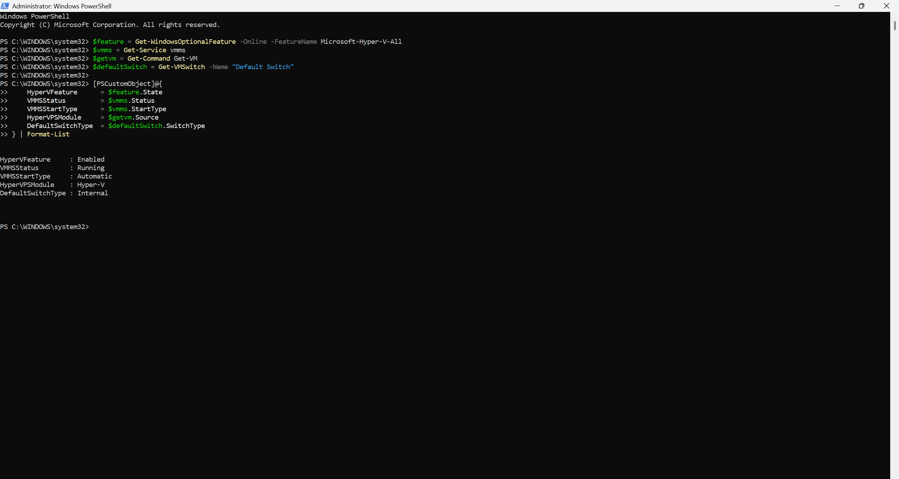

## Step 2 — Hyper-V Storage Convention

My storage inspection showed one usable Windows volume:

| Volume | File system | Size | Free space at inspection |
|---|---|---:|---:|
| `C:` | NTFS | 952.8 GB | 691.2 GB |

I created and configured this dedicated lab structure:

```text
C:\Hyper-V\BelkaCorp\
├── Virtual Machines\
└── Virtual Hard Disks\
```

```text
VirtualMachinePath  C:\Hyper-V\BelkaCorp
VirtualHardDiskPath C:\Hyper-V\BelkaCorp\Virtual Hard Disks
```

### Evidence

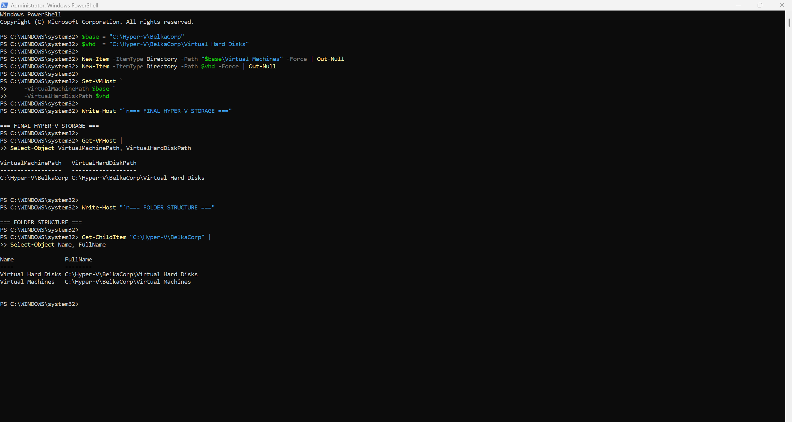

## Step 3 — Create and Verify Virtual Switches

My planned Hyper-V switches are:

```text
Default Switch -> FW01 WAN
vSW-USERS      -> Private
vSW-SERVERS    -> Private
vSW-MGMT       -> Internal
```

I created the custom switches with `New-VMSwitch`.

### Real Troubleshooting Incident — Duplicate Switch Objects

I accidentally pasted the creation commands more than once, which created duplicate switch objects with the same friendly names. I noticed the problem while using both PowerShell and Hyper-V Virtual Switch Manager. Because no lab VMs were attached yet, I removed the extra objects manually in the GUI and verified the cleaned state again with PowerShell.

I documented the incident in `troubleshooting/002-hyper-v-duplicate-virtual-switches.md`.

My final verified switch inventory was:

| Switch | Count | Type |
|---|---:|---|
| `Default Switch` | 1 | Internal |
| `vSW-MGMT` | 1 | Internal |
| `vSW-SERVERS` | 1 | Private |
| `vSW-USERS` | 1 | Private |

I also verified that each remaining switch has a distinct Hyper-V `Id`.

### Evidence


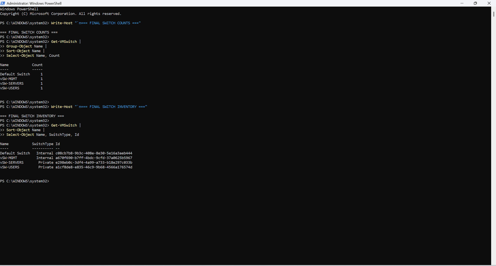

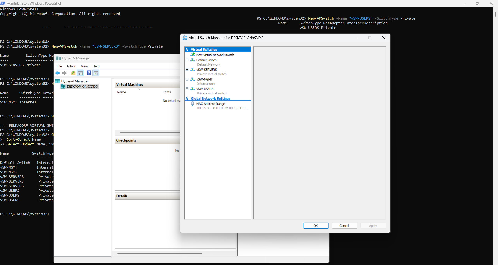

## Step 4 — Windows Host MGMT Adapter

Because `vSW-MGMT` is an Internal switch, Hyper-V created a host-side adapter named `vEthernet (vSW-MGMT)`.

Before configuration I observed:

```text
Status    Up
DHCP      Enabled
IPv4      169.254.112.94/16
```

The `169.254.x.x` address showed that the interface had no usable DHCP lease on the isolated management network.

I then deliberately configured the host management address:

```text
Interface   vEthernet (vSW-MGMT)
IPv4        10.10.30.10/24
DHCP        Disabled
Gateway     none
```

I removed the temporary link-local address, assigned `10.10.30.10/24`, and intentionally did **not** configure a default gateway on this interface so my normal Windows Internet route remains separate from the lab management network.

### Final Verification

I verified:

```text
DHCP              Disabled
ConnectionState   Connected
IPAddress         10.10.30.10
PrefixLength      24
PrefixOrigin      Manual
AddressState      Preferred
Connected route   10.10.30.0/24 -> 0.0.0.0
Default gateway   none
```

### Evidence

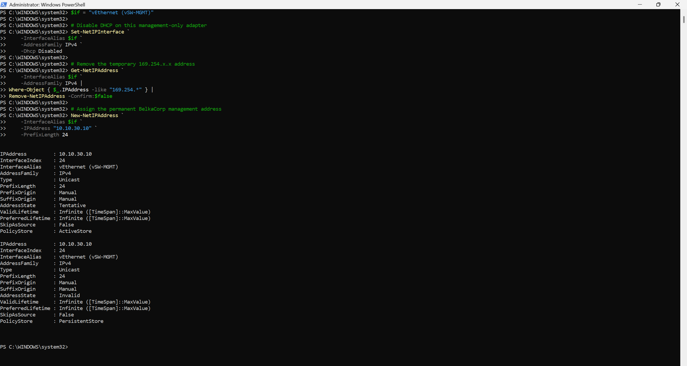

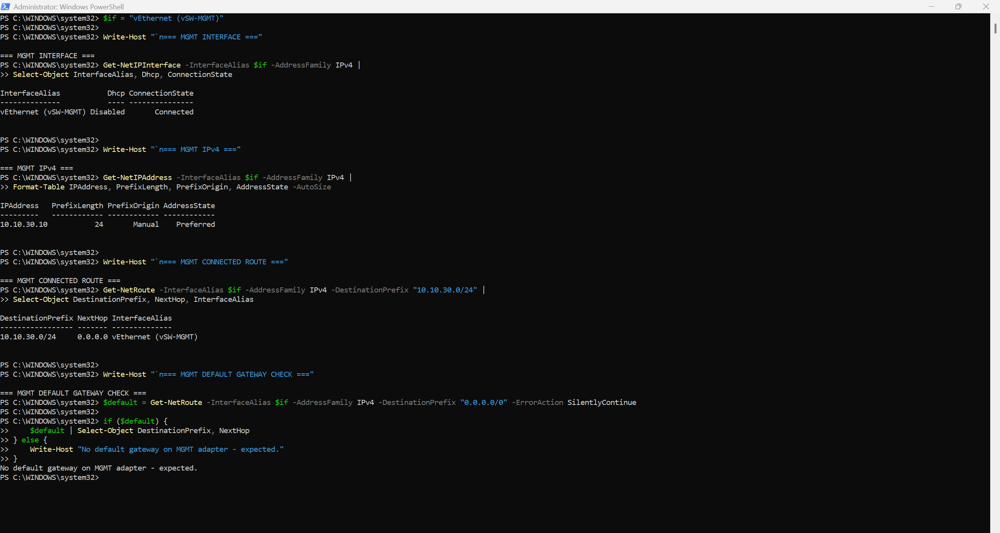

## Step 5 — TEST01 Pre-Boot Validation

I created a small temporary Linux VM to prove that the Hyper-V platform, storage convention, virtual networking, and Generation 2 firmware configuration work together before I deploy the real BelkaCorp infrastructure roles.

### TEST01 Design

```text
TEST01
├── Generation 2
├── 2 vCPU
├── 2 GB startup RAM
├── VHDX: C:\Hyper-V\BelkaCorp\Virtual Hard Disks\TEST01.vhdx
├── vNIC: vSW-MGMT
├── Ubuntu Server ISO: C:\Hyper-V\ISOs\ubuntu-26.04-live-server-amd64.iso
└── Secure Boot: Microsoft UEFI Certificate Authority
```

I used the Hyper-V Manager wizard so I could also understand the GUI workflow, then used PowerShell to verify the resulting VM configuration precisely.

### Pre-Boot Verification

| Property | Verified state |
|---|---|
| Name | `TEST01` |
| State | Off |
| Generation | 2 |
| ProcessorCount | 2 |
| MemoryStartup | 2147483648 bytes (2 GiB) |
| Virtual disk | `C:\Hyper-V\BelkaCorp\Virtual Hard Disks\TEST01.vhdx` |
| Disk controller | SCSI |
| Virtual switch | `vSW-MGMT` |
| Secure Boot | On |
| Secure Boot template | `MicrosoftUEFICertificateAuthority` |

### Evidence

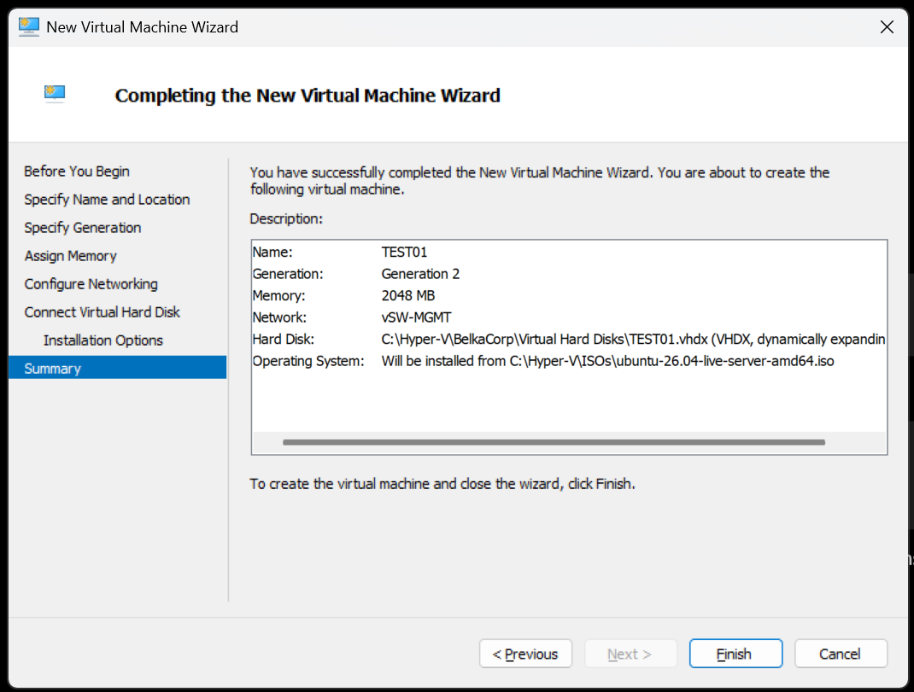

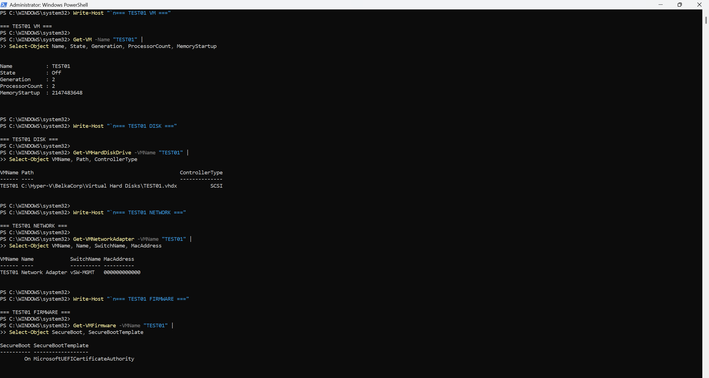

## Step 6 — Ubuntu Installation and First Boot

I booted `TEST01` from the Ubuntu Server ISO, completed the Ubuntu Server installation, rebooted from the installed VHDX, and successfully logged in to the guest console.

Observed first-boot state:

```text
VM        TEST01
State     Running
Guest OS  Ubuntu 26.04 LTS
Hostname  test01
Console   Successful login
```

### Evidence

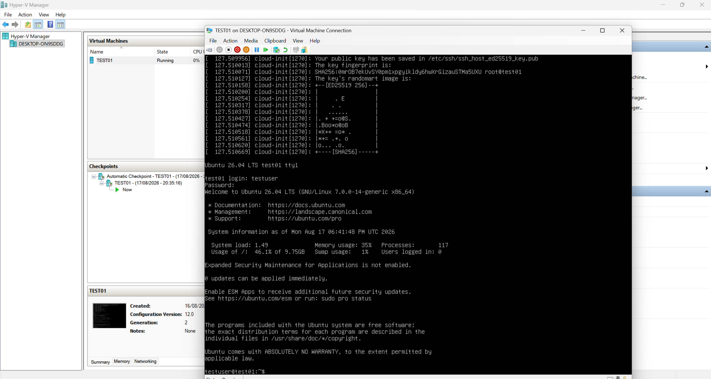

## Step 7 — TEST01 Management Networking

I inspected the actual Linux interface instead of assuming its device name.

My inspection showed:

```text
Interface  eth0
State      UP
MAC        00:15:5d:38:01:04
IPv4       none before configuration
IPv6       link-local only
IPv4 route none before configuration
```

The installer-created `/etc/netplan/00-installer-config.yaml` matched the Hyper-V MAC address and named the interface `eth0`, but it did not assign an IPv4 address.

### Static Netplan Configuration

I configured TEST01 as:

```text
IPv4      10.10.30.20/24
Interface eth0
Gateway   none
```

My Netplan configuration uses the detected Hyper-V MAC address and a static address:

```yaml
network:
  ethernets:
    eth0:
      match:
        macaddress: 00:15:5d:38:01:04
      set-name: eth0
      dhcp4: false
      addresses:
        - 10.10.30.20/24
  version: 2
```

I validated the YAML with `netplan generate`, tested it with `netplan try`, accepted the configuration, and applied it.

The resulting Linux network state was:

```text
eth0              UP
IPv4              10.10.30.20/24
Connected route   10.10.30.0/24 via eth0
Default route     none
```

### Real Troubleshooting Incident — One-Way ICMP

After configuring the address, Windows could ping TEST01 successfully, but TEST01 could not initially ping the Windows host:

```text
Windows 10.10.30.10 -> TEST01 10.10.30.20   success
TEST01 10.10.30.20  -> Windows 10.10.30.10  failed
```

Because one direction already worked, I did not assume that the Hyper-V switch or subnet design was broken. I inspected the Windows management network profile and firewall state.

The host-side `vEthernet (vSW-MGMT)` adapter was an `Unidentified network` using the `Public` network category. Windows Firewall was enabled.

I kept the firewall enabled and created a narrow inbound rule that only permits ICMPv4 echo requests from the BelkaCorp management subnet to the host management address on the MGMT interface:

```powershell
New-NetFirewallRule `
    -DisplayName "BelkaCorp MGMT - ICMPv4 Echo" `
    -Description "Allow ICMPv4 echo requests from the isolated BelkaCorp MGMT subnet to the Windows Hyper-V host." `
    -Direction Inbound `
    -Action Allow `
    -Protocol ICMPv4 `
    -IcmpType 8 `
    -InterfaceAlias "vEthernet (vSW-MGMT)" `
    -LocalAddress "10.10.30.10" `
    -RemoteAddress "10.10.30.0/24"
```

I documented the incident separately in `troubleshooting/003-windows-firewall-blocked-test01-icmp.md`.

### Final Connectivity Verification

After applying the scoped firewall rule, ping succeeded in both directions:

```text
Windows host                   TEST01
10.10.30.10/24  <---------->  10.10.30.20/24
      ping success                 ping success
```

This proves that the Hyper-V Internal switch carries traffic correctly between the Windows management OS and the Ubuntu guest, and that both static IPv4 configurations are usable on the MGMT subnet.

### Evidence

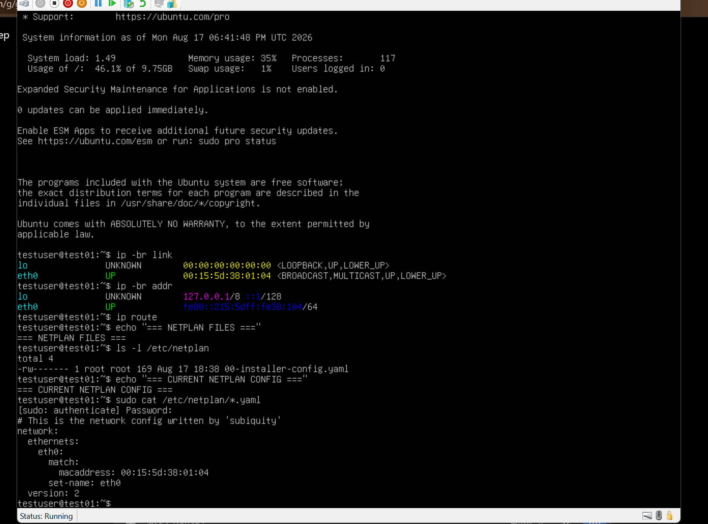

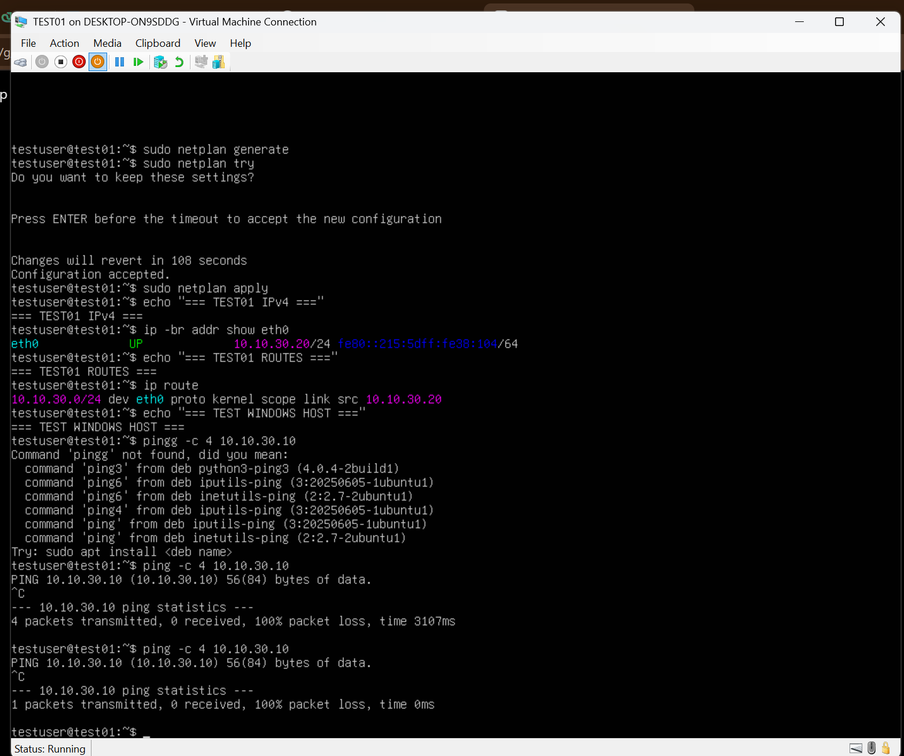

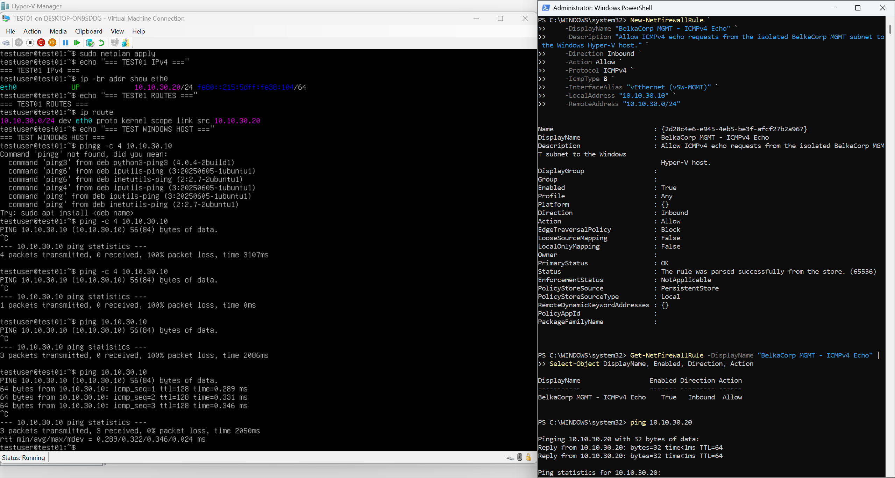

## Evidence Workflow

```text
UNDERSTAND
    |
IMPLEMENT
    |
VERIFY
    |
CAPTURE USEFUL EVIDENCE
    |
DOCUMENT
    |
COMMIT
```

## AI-Assisted Workflow

I use AI as a learning, troubleshooting, and documentation assistant during this project. I still execute and verify the infrastructure changes myself, and I only document states that I have actually observed in the lab.

## Interview Explanation Target

At the end of this chapter, I should be able to explain:

- why I selected Hyper-V for this host;
- host vs guest virtualization;
- vCPU, RAM, VHDX, virtual NICs, and virtual switches;
- External vs Internal vs Private switches;
- why my USERS and SERVERS networks are isolated from the Windows host;
- why the host joins only the MGMT network;
- why the MGMT host adapter has a static address but no default gateway;
- how I detected and corrected the duplicate-switch incident;
- why I used a Generation 2 test VM and how I verified its firmware, storage, CPU, memory, and network attachment before booting it;
- how I configured a persistent static Linux address with Netplan;
- why two hosts in the same `/24` do not require a router to communicate;
- how I isolated a one-way connectivity problem to the Windows host firewall and fixed it with a narrowly scoped rule instead of disabling firewall protection.

## Status

**IN PROGRESS**

Current step: verify TEST01 runtime CPU, memory, disk, network state, and persistence after a reboot before closing Chapter 1.
