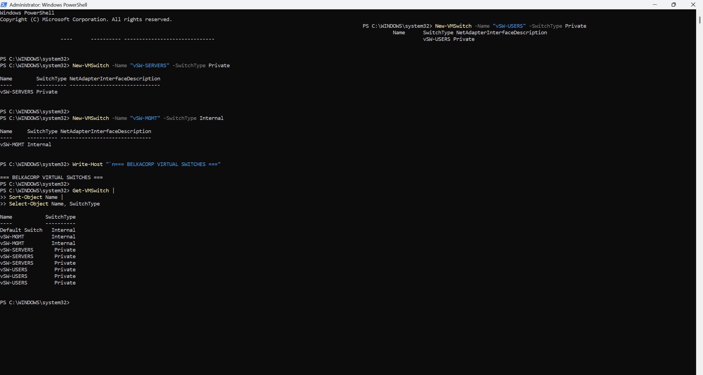

# Chapter 1 — Hyper-V Platform

## Goal

I am enabling, validating, and organizing Microsoft Hyper-V on my Windows 11 Pro desktop so the host is ready to run the BelkaCorp virtual infrastructure.

## Why This Matters in a Company

A virtualization platform allows multiple isolated operating systems and infrastructure roles to share one physical server. By building this lab myself, I am learning how to manage the host, virtual machines, virtual disks, virtual network adapters, virtual switches, resource allocation, and the difference between the management operating system and guest systems.

## What I Must Understand First

Before building VMs, I need to understand these terms:

- **Host** — my physical Windows desktop running Hyper-V.
- **Guest / VM** — an operating system running virtually on the host.
- **vCPU** — virtual processors assigned to a VM; they consume scheduling time on the physical CPU rather than representing dedicated physical cores.
- **VHDX** — Hyper-V virtual hard-disk file format.
- **Virtual NIC** — a network adapter presented to a VM.
- **Virtual switch** — a software Ethernet switch connecting VM NICs to other VMs, the Windows host, or an external network depending on switch type.

## Quick Schema

```text
PHYSICAL WINDOWS HOST
        |
        +-- Hyper-V hypervisor/platform
        |
        +-- Hyper-V Manager / PowerShell
        |
        +-- Virtual switches
        |
        +-- Virtual machines
               |
               +-- vCPU
               +-- RAM
               +-- VHDX
               +-- virtual NIC(s)
```

## Chapter Plan

1. [x] Enable the full Hyper-V Windows feature.
2. [x] Restart Windows.
3. [x] Verify the Hyper-V feature, management tools, and hypervisor state.
4. [x] Inspect the Hyper-V host configuration.
5. [x] Define VM and VHDX storage conventions.
6. [x] Create and verify the planned virtual switches.
7. [ ] Configure the Windows host's MGMT virtual adapter.
8. [ ] Deploy a small test VM.
9. [ ] Verify CPU, memory, disk, and network operation.
10. [ ] Complete evidence/documentation for the remaining Chapter 1 steps.

## Step 1 — Enable and Verify Hyper-V

I enabled Hyper-V from an elevated PowerShell session with:

```powershell
Enable-WindowsOptionalFeature -Online -FeatureName Microsoft-Hyper-V -All
```

I restarted Windows before validating the platform.

### Verified Post-Restart State

I observed the following state on 2026-08-14:

| Check | Observed state |
|---|---|
| `Microsoft-Hyper-V-All` | Enabled |
| Hyper-V Virtual Machine Management service (`vmms`) | Running, Automatic |
| Hyper-V PowerShell command `Get-VM` | Available from module `Hyper-V` |
| Hyper-V Default Switch | Present, Internal |

### Evidence


## Step 2 — Inspect Host and Define Storage Convention

My storage inspection showed one usable Windows volume:

| Volume | File system | Size | Free space |
|---|---|---:|---:|
| `C:` | NTFS | 952.8 GB | 691.2 GB |

### Final Storage Convention

I chose the following dedicated lab structure:

```text
C:\Hyper-V\BelkaCorp\
├── Virtual Machines\
└── Virtual Hard Disks\
```

I configured the Hyper-V host defaults as:

```text
VirtualMachinePath  C:\Hyper-V\BelkaCorp
VirtualHardDiskPath C:\Hyper-V\BelkaCorp\Virtual Hard Disks
```

### Evidence


**Step 2 is complete.**

## Step 3 — Create and Verify Virtual Switches

For my BelkaCorp design, I need three lab-side Hyper-V switches in addition to the Windows-managed Default Switch:

```text
Default Switch -> FW01 WAN
vSW-USERS      -> Private
vSW-SERVERS    -> Private
vSW-MGMT       -> Internal
```

I initially created them with:

```powershell
New-VMSwitch -Name "vSW-USERS" -SwitchType Private
New-VMSwitch -Name "vSW-SERVERS" -SwitchType Private
New-VMSwitch -Name "vSW-MGMT" -SwitchType Internal
```

### Real Troubleshooting Incident — Duplicate Switch Objects

While working through the commands, I pasted the creation commands more than once. This created multiple Hyper-V switch objects with the same friendly names.

I noticed the duplicate state while reviewing both PowerShell output and Hyper-V Virtual Switch Manager. Because no VMs were attached yet, I removed the extra custom switch entries manually in the GUI and then re-ran verification in PowerShell.

I documented the incident in:

`troubleshooting/002-hyper-v-duplicate-virtual-switches.md`

### Final Verification

I verified the cleaned configuration with:

```powershell
Get-VMSwitch |
    Group-Object Name |
    Sort-Object Name |
    Select-Object Name, Count

Get-VMSwitch |
    Sort-Object Name |
    Select-Object Name, SwitchType, Id
```

My final observed state is:

| Switch | Count | Type |
|---|---:|---|
| `Default Switch` | 1 | Internal |
| `vSW-MGMT` | 1 | Internal |
| `vSW-SERVERS` | 1 | Private |
| `vSW-USERS` | 1 | Private |

I also verified that each remaining switch has a distinct Hyper-V `Id`.

### Why I Chose These Types

```text
vSW-USERS      Private  -> lab VMs only
vSW-SERVERS    Private  -> lab VMs only
vSW-MGMT       Internal -> lab VMs + Windows host
```

The virtual switch itself does not own the subnet gateway IP. Later, the `FW01` virtual NIC attached to each network will own the `.1` gateway address for that subnet.

### Evidence




**Step 3 is complete and fully evidenced.**

## Step 4 — Windows Host MGMT Adapter

Next, I will inspect the host-side `vEthernet (vSW-MGMT)` adapter created by the Internal switch and deliberately assign its management-network address. I will not configure a default gateway on this adapter, because I do not want it to interfere with my Windows host's normal Internet route.

## Evidence Workflow

```text
UNDERSTAND
    |
    v
IMPLEMENT
    |
    v
VERIFY
    |
    v
CAPTURE USEFUL EVIDENCE
    |
    v
DOCUMENT
    |
    v
COMMIT
```

## GitHub Evidence Rule

I do not commit passwords, license keys, Windows product keys, private addresses unrelated to the isolated lab, or unnecessary raw system dumps.

I only keep evidence that demonstrates a validated state, a sanitized configuration, real troubleshooting, or a meaningful project result.

## AI-Assisted Workflow

I use AI as a learning, troubleshooting, and documentation assistant during this project. I still execute and verify the infrastructure changes myself, and I only document states that I have actually observed in the lab.

## Interview Explanation Target

At the end of the chapter, I should be able to explain:

- why I selected Hyper-V for this host;
- host vs guest virtualization;
- vCPU, RAM, VHDX, virtual NICs, and virtual switches;
- External vs Internal vs Private switches;
- how my BelkaCorp VM networks remain isolated while `FW01` performs routing;
- how my physical Windows workstation retains a management path into the lab;
- how I detected, corrected, and verified the duplicate-switch incident.

## Status

**IN PROGRESS**

Current step: configure and verify the Windows host's `vEthernet (vSW-MGMT)` adapter.
