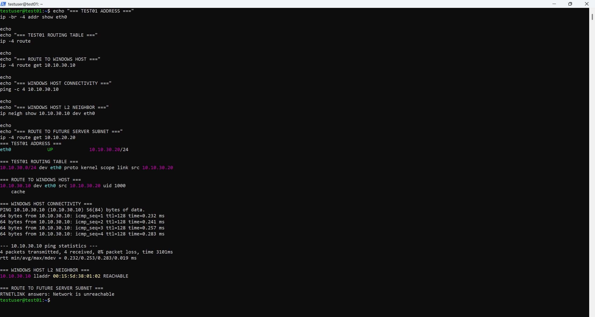

# Chapter 2 — Network Architecture and IP Design

## Goal

I am defining how the BelkaCorp networks should behave before I deploy the firewall/router that will connect them. Chapter 1 established the Hyper-V platform and virtual switches; this chapter turns those isolated Layer-2 segments into a documented network design with clear addressing, gateway, routing, DHCP, and DNS ownership decisions.

## Why This Matters in a Company

A working virtual switch does not by itself create a usable enterprise network. I need to understand which systems belong to each subnet, which traffic is local, which traffic requires routing, which device owns each default gateway, and how address and name services will be provided. Defining those responsibilities before deployment reduces accidental routing, overlapping addresses, and unclear security boundaries.

## Starting State

At the start of Chapter 2, the Hyper-V platform is complete and the following virtual switches already exist:

| Switch | Type | Current role |
|---|---|---|
| Default Switch | Internal | Planned upstream/WAN side for `FW01` |
| `vSW-MGMT` | Internal | Management network shared by the Windows host and lab VMs |
| `vSW-SERVERS` | Private | Future server network |
| `vSW-USERS` | Private | Future user/client network |

The Windows host currently has `10.10.30.10/24` on `vEthernet (vSW-MGMT)`. `TEST01` remains available at `10.10.30.20/24` as a temporary validation VM.

`FW01` has not been deployed yet, so the planned gateway addresses `10.10.10.1`, `10.10.20.1`, and `10.10.30.1` do not yet exist.

## Chapter 2 Plan

- [x] 2.1A — Verify the Windows host network baseline
- [x] 2.1B — Verify the TEST01 guest network baseline
- [x] 2.2 — Confirm subnet and address allocation
- [x] 2.3 — Define Layer-2 and Layer-3 boundaries
- [x] 2.4 — Define gateway and routing behavior
- [x] 2.5 — Define DHCP and DNS ownership
- [ ] 2.6 — Produce the final network implementation plan
- [ ] 2.7 — Complete the Chapter 2 audit

## 2.1A — Windows Host Network Baseline

I verified the host-side network state before introducing any routing device.

### Virtual switches

The host reports one instance of each planned switch:

```text
Default Switch  Internal
vSW-MGMT        Internal
vSW-SERVERS     Private
vSW-USERS       Private
```

### Management address

The Windows management interface is manually configured as:

```text
Interface  vEthernet (vSW-MGMT)
IPv4       10.10.30.10/24
Origin     Manual
```

### Management routes

Windows has an on-link route for the management subnet:

```text
10.10.30.0/24 -> next hop 0.0.0.0
```

The `0.0.0.0` next-hop value in this route means the destination is directly reachable on that interface. Windows does not need a router to reach another host in `10.10.30.0/24`; it can resolve the destination at Layer 2 and send directly through `vSW-MGMT`.

Windows also created the normal interface-local host, broadcast, multicast, and limited-broadcast routes associated with this IPv4 interface.

### Default route

The host's IPv4 default route remains:

```text
Interface  Wi-Fi
Next hop   192.168.0.1
```

There is no default route through `vEthernet (vSW-MGMT)`. This confirms that the isolated lab management network does not replace the Windows host's normal Internet path.

### Evidence


This evidence captures the final switch inventory, the host's manual `10.10.30.10/24` management address, its directly connected MGMT route, and the normal Wi-Fi default route.

## 2.1B — TEST01 Guest Network Baseline

I then verified the same management network from inside the Linux guest.

### Guest address and connected route

TEST01 reports:

```text
eth0  UP  10.10.30.20/24
```

Its IPv4 routing table contains:

```text
10.10.30.0/24 dev eth0 proto kernel scope link src 10.10.30.20
```

This means TEST01 also treats `10.10.30.0/24` as directly connected.

### Route to the Windows host

For destination `10.10.30.10`, Linux selected:

```text
10.10.30.10 dev eth0 src 10.10.30.20
```

There is no `via` gateway in this decision because both systems are in the same `/24` subnet.

### Layer-2 neighbor resolution

After successful communication with the Windows host, TEST01 learned the host's Layer-2 neighbor mapping:

```text
10.10.30.10 lladdr 00:15:5d:38:01:02 REACHABLE
```

This confirms that TEST01 resolves the destination IP to the Windows host's MAC address and delivers the frame directly through `vSW-MGMT`.

### Connectivity

The guest successfully reached the Windows host:

```text
4 packets transmitted
4 received
0% packet loss
```

### Route to the future SERVERS subnet

When TEST01 tried to resolve a route toward the future server address `10.10.20.20`, Linux returned:

```text
RTNETLINK answers: Network is unreachable
```

This is expected in the pre-router state. TEST01 has no route for `10.10.20.0/24`, no default gateway, and no `FW01` interface yet to forward traffic between MGMT and SERVERS.

### Evidence



This evidence shows TEST01's `10.10.30.20/24` address, its directly connected MGMT route, direct route selection to the Windows host, successful 4/4 connectivity, the learned Layer-2 neighbor entry, and the expected unreachable result for the future SERVERS subnet.

## What the Pre-Router Baseline Proves

Both systems independently make the same decision for management traffic:

```text
Windows 10.10.30.10          TEST01 10.10.30.20
        |                            |
        +-------- vSW-MGMT ----------+
               10.10.30.0/24

Same subnet -> direct Layer-2 delivery
Different subnet -> no BelkaCorp route yet
```

A router is therefore unnecessary for communication inside `10.10.30.0/24`, but a Layer-3 device will be required when traffic must move between MGMT, SERVERS, and USERS.

## 2.2 — Subnet and Address Allocation

I use the private `10.10.0.0/16` block as the BelkaCorp address space and divide the current lab into three `/24` networks.

| Network | Subnet | Planned gateway | Main use |
|---|---|---|---|
| USERS | `10.10.10.0/24` | `10.10.10.1` | User/client systems |
| SERVERS | `10.10.20.0/24` | `10.10.20.1` | Infrastructure and application servers |
| MGMT | `10.10.30.0/24` | `10.10.30.1` | Administration and management access |

For each `/24`, the `.0` address is the network address and `.255` is the broadcast address, leaving `.1` through `.254` as usable host addresses.

The `.1` address is not reserved by IPv4 itself; I intentionally reserve it in my design as the default-gateway address on each subnet so the addressing convention remains predictable.

### Addressing convention

```text
.1           FW01 / default gateway
.2 - .9      reserved infrastructure
.10 - .49    static infrastructure and servers
.50 - .99    future static systems
.100 - .199  dynamic clients where DHCP is appropriate
.200 - .254  spare / future use
```

This is a design convention rather than a protocol requirement, and I only use the ranges where they make sense for the specific subnet.

### Current planned assignments

```text
USERS — 10.10.10.0/24
10.10.10.1         FW01
10.10.10.100-.199  planned DHCP pool

SERVERS — 10.10.20.0/24
10.10.20.1         FW01
10.10.20.10        DC01
10.10.20.20        LNX01
10.10.20.30        MON01

MGMT — 10.10.30.0/24
10.10.30.1         FW01
10.10.30.10        Windows host
10.10.30.20        TEST01 (temporary)
```

The third octet also reflects the network purpose (`10` USERS, `20` SERVERS, `30` MGMT), which makes addresses easier to recognize during configuration and troubleshooting.

## 2.3 — Layer-2 and Layer-3 Boundaries

I treat each custom Hyper-V virtual switch as a separate Layer-2 Ethernet segment and broadcast domain. The switches forward Ethernet frames within their own segment by using MAC-address information; they do not route IP traffic between the BelkaCorp subnets.

```text
vSW-USERS    -> USERS   -> 10.10.10.0/24
vSW-SERVERS  -> SERVERS -> 10.10.20.0/24
vSW-MGMT     -> MGMT    -> 10.10.30.0/24
```

A broadcast on one of these switches does not cross into either of the other custom switches. This preserves three distinct Layer-2 boundaries rather than creating one shared LAN.

### Same-subnet communication

Systems in the same `/24` communicate directly at Layer 2. They determine that the destination IP is local, resolve the destination's MAC address through ARP, and send the Ethernet frame through the local virtual switch without involving a router.

The current Windows host and TEST01 relationship is the verified example:

```text
Windows 10.10.30.10          TEST01 10.10.30.20
        |                            |
        +-------- vSW-MGMT ----------+

same subnet -> ARP -> destination MAC -> direct frame delivery
```

### Cross-subnet communication

Communication between USERS, SERVERS, and MGMT requires Layer-3 routing. `FW01` will later connect to each Layer-2 segment with a separate virtual NIC and will own the planned `.1` address on each subnet.

```text
                 FW01
             Layer 3 router
          /        |        \
         /         |         \
10.10.10.1   10.10.20.1   10.10.30.1
     |             |             |
vSW-USERS    vSW-SERVERS     vSW-MGMT
     |             |             |
  USERS          SERVERS         MGMT
```

`FW01` will route between these networks; it will not bridge them into one Layer-2 domain.

### Layer-2 next hop versus Layer-3 destination

For cross-subnet traffic, the final destination IP remains the remote host, while the destination MAC on the first Ethernet frame is the local default gateway's MAC address.

For example, when a future `CLIENT01` at `10.10.10.125/24` sends traffic to `DC01` at `10.10.20.10/24`:

```text
First Ethernet frame on USERS:
source MAC       CLIENT01 MAC
destination MAC  FW01 USERS-interface MAC

IP packet:
source IP        10.10.10.125
destination IP   10.10.20.10
```

After `FW01` makes the routing decision, it creates a new Layer-2 frame on the SERVERS segment:

```text
Ethernet frame on SERVERS:
source MAC       FW01 SERVERS-interface MAC
destination MAC  DC01 MAC

IP packet:
source IP        10.10.10.125
destination IP   10.10.20.10
```

This makes the boundary explicit: IP identifies the end-to-end logical destination, while the Ethernet MAC destination identifies the next Layer-2 hop on the current local segment.

## 2.4 — Gateway and Routing Behavior

Each normal BelkaCorp host will use the `FW01` address that belongs to its own local subnet as its default gateway.

```text
USERS hosts    -> 10.10.10.1
SERVERS hosts  -> 10.10.20.1
MGMT hosts     -> 10.10.30.1 where appropriate
```

A host must be able to reach its gateway directly at Layer 2. For example, `CLIENT01` in `10.10.10.0/24` can ARP for `10.10.10.1`; using `10.10.20.1` as its gateway would be invalid because that address is already on a remote subnet.

### Directly connected routes on FW01

When `FW01` is later configured with these interfaces:

```text
USERS    10.10.10.1/24
SERVERS  10.10.20.1/24
MGMT     10.10.30.1/24
```

it will automatically know that the three internal networks are directly connected:

```text
10.10.10.0/24 -> USERS interface
10.10.20.0/24 -> SERVERS interface
10.10.30.0/24 -> MGMT interface
```

I therefore do not need to add static routes on `FW01` for these directly attached networks. Static routing becomes relevant only for destinations that are not directly connected and are not otherwise learned.

### Host route selection

A host first checks whether the destination is local. If it is remote, the host consults its routing table and chooses the most specific matching route. A more specific prefix such as `/24` is preferred over the default `/0` route; this is longest-prefix matching.

### Windows host exception

The Windows Hyper-V host already uses the home router on Wi-Fi as its normal Internet default gateway:

```text
0.0.0.0/0 -> 192.168.0.1 -> Wi-Fi
```

I do not plan to replace that route with the BelkaCorp gateway. After `FW01` exists, the Windows host can instead use specific routes for the internal BelkaCorp networks while keeping normal Internet traffic on Wi-Fi:

```text
10.10.10.0/24 -> via 10.10.30.1
10.10.20.0/24 -> via 10.10.30.1
0.0.0.0/0     -> via 192.168.0.1
```

For a destination such as `10.10.20.10`, Windows will select the `/24` BelkaCorp route through `FW01` because it is more specific than the `/0` Wi-Fi default route.

These routes are part of the planned design only; I will not add them until `FW01` and its MGMT interface actually exist.

### Round-trip routing

Routing must work in both directions. If the Windows host at `10.10.30.10` later contacts `DC01` at `10.10.20.10`, the path will be:

```text
Windows 10.10.30.10
    |
    | 10.10.20.0/24 via 10.10.30.1
    v
FW01 MGMT 10.10.30.1
    |
    | directly connected route to 10.10.20.0/24
    v
FW01 SERVERS 10.10.20.1
    |
    v
DC01 10.10.20.10
```

On the return path, `DC01` sees `10.10.30.10` as remote and sends the reply to its own local gateway, `10.10.20.1`. `FW01` then routes the packet back out the MGMT interface toward Windows.

This reinforces the rule that a host's gateway belongs to the host's own subnet; a remote subnet's `.1` address is not used directly as that host's gateway.

### Routing versus firewall policy

A valid route only tells `FW01` where traffic can go. Firewall policy separately determines whether that traffic is permitted. Chapter 2 defines the routing behavior; the actual routing/firewall implementation belongs to the later firewall chapter.

## 2.5 — DHCP and DNS Ownership

I will keep infrastructure addressing predictable by using static addresses for the firewall interfaces, servers, and management systems, while using DHCP for normal client systems on the USERS network.

### DHCP ownership

`DC01` will provide the Windows Server DHCP service. The initial USERS scope is planned as:

```text
Network        10.10.10.0/24
Dynamic pool   10.10.10.100 - 10.10.10.199
Gateway        10.10.10.1
DNS server     10.10.20.10
```

A future client could therefore receive configuration such as:

```text
CLIENT01
IP       10.10.10.125
Mask     255.255.255.0
Gateway  10.10.10.1
DNS      10.10.20.10
```

The SERVERS and MGMT networks will remain primarily statically addressed because infrastructure systems need stable, predictable addresses.

### DHCP relay requirement

`CLIENT01` and `DC01` will be in different broadcast domains. A client's initial DHCP discovery is a local broadcast, and routers do not normally forward that broadcast between subnets.

`FW01` will therefore provide DHCP relay behavior for the USERS network and forward the request toward the DHCP server at `10.10.20.10`.

```text
CLIENT01
   |
   | DHCP broadcast
   v
vSW-USERS
   |
   v
FW01 USERS interface
   |
   | DHCP relay
   v
DC01 10.10.20.10
DHCP server
```

The relay allows the DHCP server to determine which client subnet originated the request and select the appropriate DHCP scope. `FW01` relays the traffic; `DC01` remains the system that owns the scope and leases the client configuration.

### DNS ownership

`DC01` will also provide DNS for the BelkaCorp Active Directory environment. Domain-joined clients will use `10.10.20.10` as their internal DNS server rather than querying a public resolver directly.

Active Directory depends on DNS not only for normal host-name resolution but also for service discovery. AD-integrated DNS records allow clients to locate domain controllers and services such as Kerberos, LDAP, and the Global Catalog.

A public DNS resolver can resolve public Internet names, but it does not own the private BelkaCorp Active Directory DNS data. Using a public resolver directly on domain clients would therefore prevent reliable discovery of internal AD services.

For external names, the intended flow is:

```text
CLIENT01
   |
   | DNS query
   v
DC01 DNS
   |
   | forward / recurse upstream as configured later
   v
External DNS
```

This keeps internal DNS ownership on `DC01` while still allowing clients to resolve public Internet names.

### Service ownership summary

```text
FW01
- routing
- firewall policy
- DHCP relay between routed subnets

DC01
- Active Directory Domain Services later
- internal / AD-integrated DNS
- DHCP server and scopes

CLIENT01
- DHCP client
- uses DC01 for DNS
```

These are design decisions only at this stage. `FW01`, `DC01`, DHCP, DNS, and Active Directory have not yet been deployed or configured.

## Status

**Chapter 2 is IN PROGRESS.** The pre-router baseline, subnet/address allocation, Layer-2/Layer-3 boundaries, gateway/routing behavior, and DHCP/DNS ownership are now defined. The next step is to produce the final network implementation plan.