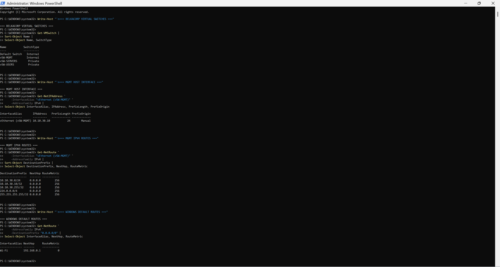

# Chapter 2 — Network Architecture and IP Design

## Goal

I am defining how the BelkaCorp networks should behave before I deploy the firewall/router that will connect them. Chapter 1 established the Hyper-V platform and virtual switches; this chapter turns those isolated Layer-2 segments into a documented network design with clear addressing, gateway, routing, DHCP, and DNS ownership decisions.

## Why This Matters in a Company

A working virtual switch does not by itself create a usable enterprise network. I need to understand which systems belong to each subnet, which traffic is local, which traffic requires routing, which device owns each default gateway, and how address and name services will be provided. Defining those responsibilities before deployment reduces accidental routing, overlapping addresses, and unclear security boundaries.

## Starting State

At the start of Chapter 2, the Hyper-V platform is complete and the following virtual switches already exist:

| Switch | Type | Current role |
|---|---|---|
| Default Switch | Internal | Planned upstream/WAN side for `FW01` |
| `vSW-MGMT` | Internal | Management network shared by the Windows host and lab VMs |
| `vSW-SERVERS` | Private | Future server network |
| `vSW-USERS` | Private | Future user/client network |

The Windows host currently has `10.10.30.10/24` on `vEthernet (vSW-MGMT)`. `TEST01` remains available at `10.10.30.20/24` as a temporary validation VM.

`FW01` has not been deployed yet, so the planned gateway addresses `10.10.10.1`, `10.10.20.1`, and `10.10.30.1` do not yet exist.

## Chapter 2 Plan

- [x] 2.1A — Verify the Windows host network baseline
- [ ] 2.1B — Verify the TEST01 guest network baseline
- [ ] 2.2 — Confirm subnet and address allocation
- [ ] 2.3 — Define Layer-2 and Layer-3 boundaries
- [ ] 2.4 — Define gateway and routing behavior
- [ ] 2.5 — Define DHCP and DNS ownership
- [ ] 2.6 — Produce the final network implementation plan
- [ ] 2.7 — Complete the Chapter 2 audit

## 2.1A — Windows Host Network Baseline

I verified the host-side network state before introducing any routing device.

### Virtual switches

The host reports one instance of each planned switch:

```text
Default Switch  Internal
vSW-MGMT        Internal
vSW-SERVERS     Private
vSW-USERS       Private
```

### Management address

The Windows management interface is manually configured as:

```text
Interface  vEthernet (vSW-MGMT)
IPv4       10.10.30.10/24
Origin     Manual
```

### Management routes

Windows has an on-link route for the management subnet:

```text
10.10.30.0/24 -> next hop 0.0.0.0
```

The `0.0.0.0` next-hop value in this route means the destination is directly reachable on that interface. Windows does not need a router to reach another host in `10.10.30.0/24`; it can resolve the destination at Layer 2 and send directly through `vSW-MGMT`.

Windows also created the normal interface-local host, broadcast, multicast, and limited-broadcast routes associated with this IPv4 interface.

### Default route

The host's IPv4 default route remains:

```text
Interface  Wi-Fi
Next hop   192.168.0.1
```

There is no default route through `vEthernet (vSW-MGMT)`. This confirms that the isolated lab management network does not replace the Windows host's normal Internet path.

### Evidence



This evidence captures the final switch inventory, the host's manual `10.10.30.10/24` management address, its directly connected MGMT route, and the normal Wi-Fi default route.

## What This Baseline Proves

At this point the Windows host knows how to reach `10.10.30.0/24` directly, but it has no BelkaCorp route toward the future USERS or SERVERS subnets. That is expected because `FW01` has not been deployed yet.

The current behavior is therefore:

```text
Windows 10.10.30.10
        |
        | destination 10.10.30.x
        v
   direct Layer-2 delivery
        |
     vSW-MGMT
```

A destination such as `10.10.20.20` will later require a Layer-3 gateway and routing path through `FW01`.

## Status

**Chapter 2 is IN PROGRESS.** The Windows host network baseline is verified. The next step is to verify TEST01 from inside the guest so I have both sides of the pre-router management network documented before moving into the subnet and routing design.
