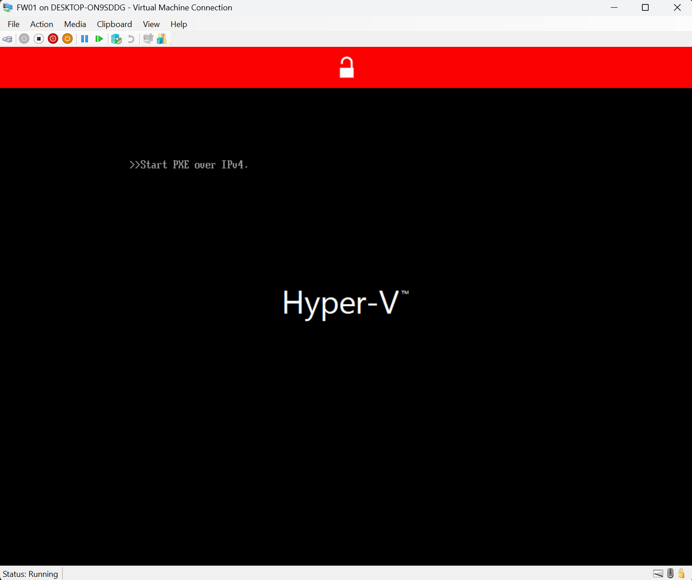
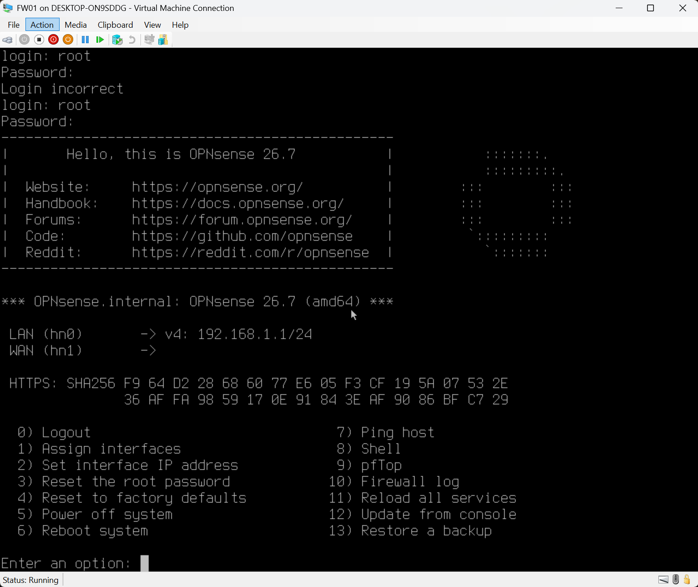
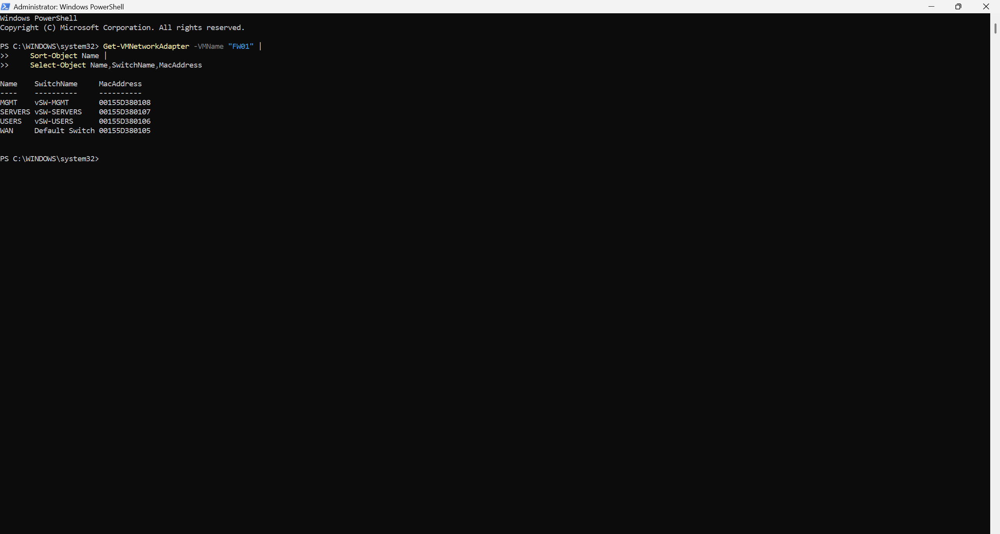
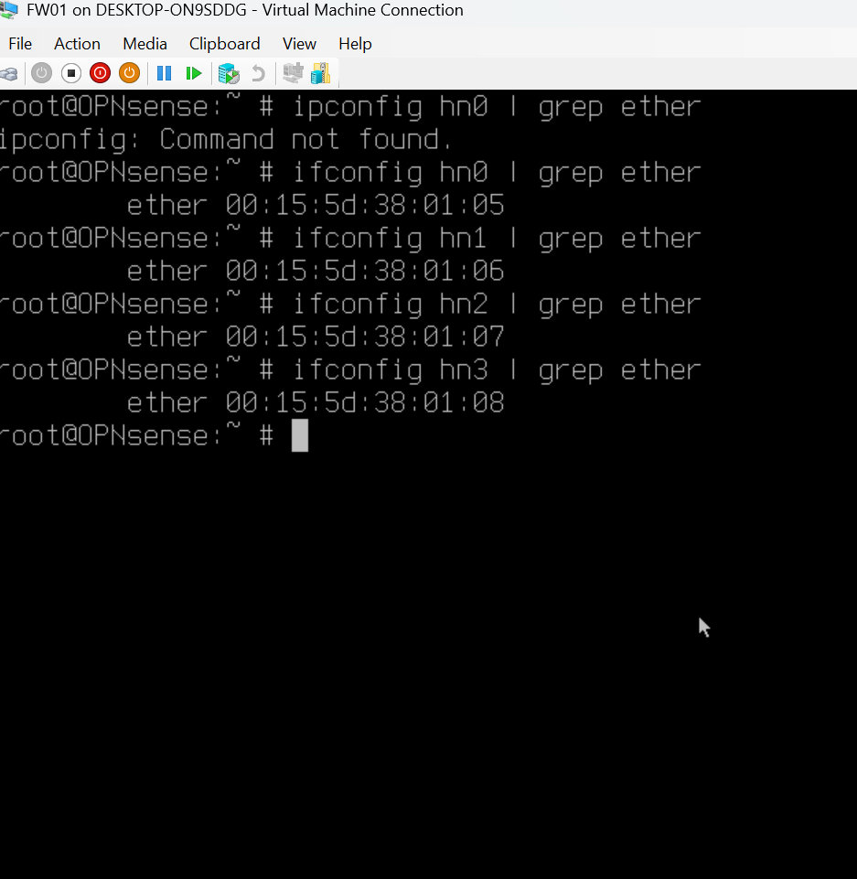
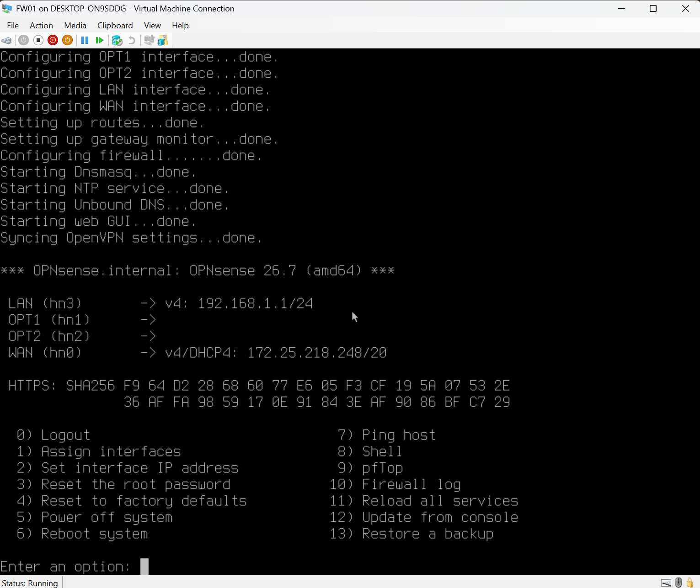
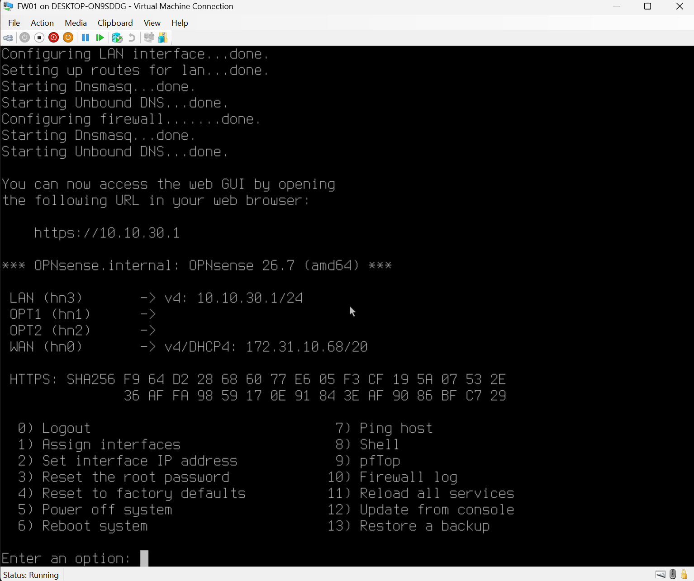
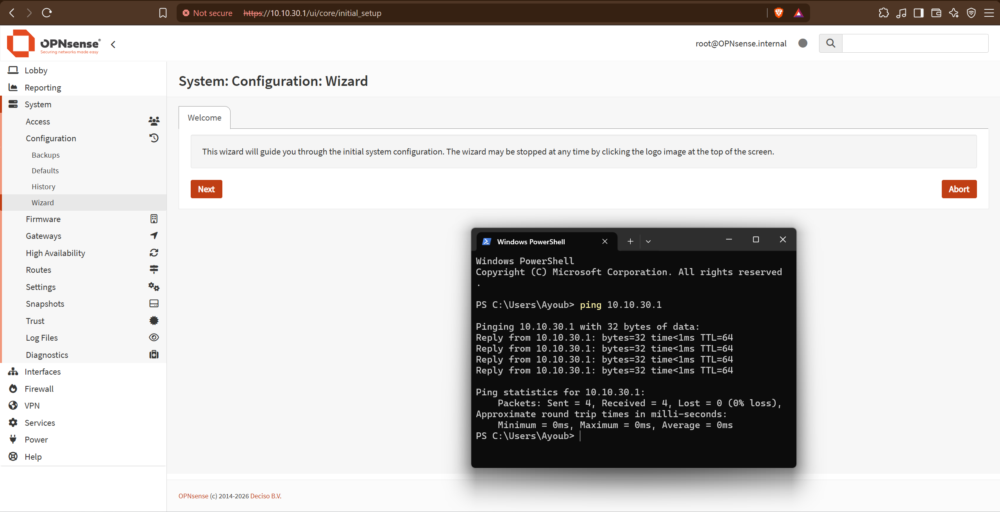
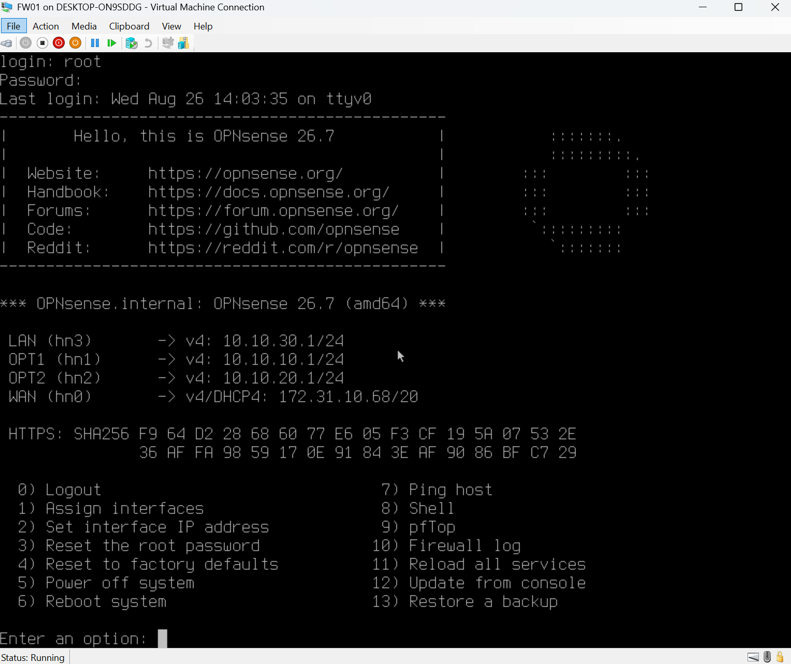

# Chapter 3 — Firewall and Routing

## Goal

I am deploying `FW01` as the Layer-3 router and firewall for the BelkaCorp lab. The immediate objective is to turn the three isolated Hyper-V networks from Chapter 2 into routed networks while preserving clear security boundaries and keeping the Windows host's normal Internet route separate from the lab.

## Why This Matters in a Company

A firewall/router is the control point between network segments. It must have the correct interfaces, addresses, routes, and policy before servers and clients can reliably communicate across subnets. I am therefore building and verifying `FW01` in stages rather than assigning routes or deploying later services before the router actually exists.

## Chapter 3 Plan

- [x] 3.1 — Verify the pre-deployment Hyper-V baseline and OPNsense installer
- [x] 3.2 — Create and verify the `FW01` VM before first boot
- [x] 3.3 — Install OPNsense
- [x] 3.4 — Identify and map the four interfaces
- [x] 3.5 — Configure USERS, SERVERS, and MGMT gateway interfaces
- [ ] 3.6 — Verify management connectivity and routing foundation
- [ ] 3.7 — Add the Windows host's specific BelkaCorp routes
- [ ] 3.8 — Validate routed traffic and initial firewall behavior
- [ ] 3.9 — Complete the Chapter 3 audit

## 3.1 — Pre-Deployment Baseline and Installer Verification

Before creating the firewall VM, I verified that no existing `FW01` VM was present and confirmed the expected Hyper-V switch inventory:

```text
Default Switch  Internal
vSW-MGMT        Internal
vSW-SERVERS     Private
vSW-USERS       Private
```

At that point, the Hyper-V ISO directory contained only the existing Ubuntu Server installer, so the OPNsense installer still had to be added.

I downloaded the OPNsense 26.7 DVD image for `amd64` and verified the compressed installer with SHA-256 before extraction. The calculated hash matched the expected release hash:

```text
95CAFEDDA6D5B22CE832E249DC2309110FBEE19F813AD78CF28BB3D387186BFB
```

I then extracted the ISO and staged it at:

```text
C:\Hyper-V\ISOs\OPNsense-26.7-dvd-amd64.iso
```

### Evidence


## 3.2 — FW01 VM Creation and Pre-Boot Verification

I used the Hyper-V New Virtual Machine Wizard to create the initial `FW01` VM shell with:

```text
Name             FW01
Generation       2
Startup memory   4096 MB
Initial network  Default Switch
Virtual disk     C:\Hyper-V\BelkaCorp\Virtual Hard Disks\FW01.vhdx
Disk type        dynamically expanding VHDX
Installer        C:\Hyper-V\ISOs\OPNsense-26.7-dvd-amd64.iso
```

### Wizard Evidence


### Initial PowerShell Audit

I inspected the actual Hyper-V VM object before first boot instead of assuming the wizard defaults matched the intended firewall design.

The initial audit showed:

```text
State                    Off
Generation               2
Automatic checkpoints    Enabled
vCPU                     12
Dynamic Memory           Disabled
Startup memory           4096 MB
Secure Boot              Enabled
VHDX                     C:\Hyper-V\BelkaCorp\Virtual Hard Disks\FW01.vhdx
DVD                       C:\Hyper-V\ISOs\OPNsense-26.7-dvd-amd64.iso
Network adapters          1
```

The fixed 4096 MB memory policy, virtual disk path, installer path, VM generation, and powered-off state were already correct. The displayed minimum/maximum memory values were not active limits because Dynamic Memory was disabled.

The audit exposed four settings that required correction:

```text
12 vCPU                  -> 2 vCPU
Automatic checkpoints   -> Disabled
Secure Boot              -> Disabled
1 network adapter        -> 4 total adapters
```

### Evidence


### Pre-Boot Remediation

While `FW01` remained powered off, I changed the processor count to 2, disabled automatic checkpoints, disabled Secure Boot, renamed the existing Default Switch adapter to `WAN`, and added the three internal adapters.

The intended adapter mapping is now implemented at the Hyper-V layer:

```text
WAN      -> Default Switch
USERS    -> vSW-USERS
SERVERS  -> vSW-SERVERS
MGMT     -> vSW-MGMT
```

### Final Pre-Boot Verification

A clean PowerShell verification confirmed:

```text
State                    Off
Generation               2
Automatic checkpoints    Disabled
vCPU                     2
Dynamic Memory           Disabled
Startup memory           4096 MB
Secure Boot              Off
VHDX                     C:\Hyper-V\BelkaCorp\Virtual Hard Disks\FW01.vhdx
DVD                       C:\Hyper-V\ISOs\OPNsense-26.7-dvd-amd64.iso

MGMT      -> vSW-MGMT
SERVERS   -> vSW-SERVERS
USERS     -> vSW-USERS
WAN       -> Default Switch
```

The adapters still displayed `000000000000` before the first boot because Hyper-V had not yet assigned their dynamic MAC addresses. That did not invalidate the switch mapping.

### Evidence


I did not add the Windows host's routes to `10.10.10.0/24` or `10.10.20.0/24`, because `10.10.30.1` was not yet a configured, verified next hop.

## 3.3 — Install OPNsense

### First Boot from the Installer ISO

I started `FW01` for the first time with the verified OPNsense ISO still attached. Hyper-V showed the VM in a running state and the console reached the OPNsense boot menu, confirming that the Generation 2 VM can boot the installer successfully with Secure Boot disabled.

I continued with the default multi-user boot. OPNsense completed the live-environment startup and reached the console login prompt.

### Evidence


This screenshot proves the first successful boot from the OPNsense installation media and shows `FW01` running in Hyper-V.

### Installation to the Virtual Disk

From the live environment I entered the installer, kept the default keymap, selected ZFS, chose a single-disk stripe layout, selected `da0`, and installed OPNsense to the dedicated `FW01.vhdx` virtual disk. I then set the root password, completed the installation, and halted the VM instead of immediately rebooting.

Before the first boot of the installed system, I explicitly detached the OPNsense ISO and verified the storage state with PowerShell:

```text
DVD drives                 no mounted ISO paths
Virtual hard disk          C:\Hyper-V\BelkaCorp\Virtual Hard Disks\FW01.vhdx
```

### Post-Install Boot Troubleshooting

The first start after removing the ISO did not reach OPNsense. Hyper-V displayed `Start PXE over IPv4`, showing that the firmware had moved on to network boot instead of successfully starting the installed virtual disk.

I did not reinstall OPNsense. I verified that `FW01.vhdx` was still attached on SCSI `0:0`, that Secure Boot remained off, and that the firmware boot order contained mixed drive and network entries.

I then explicitly set `FW01.vhdx` as the first boot device and verified the detailed firmware order before retrying the boot.

### Evidence



### Successful Installed-Disk Boot

After placing `FW01.vhdx` first in the firmware boot order, I started `FW01` again with the installer ISO still detached. OPNsense 26.7 booted successfully and I logged in as `root`, reaching the normal installed console menu.

The console initially showed OPNsense's automatic/default interface state (`LAN` on `hn0` with `192.168.1.1/24` and `WAN` on `hn1`). I did not treat those defaults as the BelkaCorp design because the guest interfaces first had to be matched to the Hyper-V adapters by MAC address.

### Evidence



This screenshot proves that the installed OPNsense system is bootable from `FW01.vhdx` with the installer ISO detached and that the normal console is available.

The PXE incident is documented separately in `../troubleshooting/006-fw01-post-install-pxe-boot.md`.

## 3.4 — Identify and Map the Four Interfaces

### Hyper-V Side — Authoritative Adapter and MAC Map

Before changing any OPNsense interface assignment, I captured the authoritative Hyper-V view of all four `FW01` virtual network adapters:

```text
Name      SwitchName       MAC
WAN       Default Switch   00:15:5D:38:01:05
USERS     vSW-USERS        00:15:5D:38:01:06
SERVERS   vSW-SERVERS      00:15:5D:38:01:07
MGMT      vSW-MGMT         00:15:5D:38:01:08
```

### Evidence



### OPNsense Side — Guest Interface MAC Map

From the OPNsense shell I queried the Ethernet address of each Hyper-V synthetic interface with `ifconfig`:

```text
hn0   00:15:5D:38:01:05
hn1   00:15:5D:38:01:06
hn2   00:15:5D:38:01:07
hn3   00:15:5D:38:01:08
```

Matching the identical MAC addresses gives the verified interface map:

```text
WAN      -> hn0 -> 00:15:5D:38:01:05 -> Default Switch
USERS    -> hn1 -> 00:15:5D:38:01:06 -> vSW-USERS
SERVERS  -> hn2 -> 00:15:5D:38:01:07 -> vSW-SERVERS
MGMT     -> hn3 -> 00:15:5D:38:01:08 -> vSW-MGMT
```

This also proves that the automatic OPNsense defaults shown after installation were not correct for the BelkaCorp design: `hn0` is the intended WAN adapter, while `hn1` is the intended USERS adapter.

### Evidence



### Applied OPNsense Role Assignment

I then used the OPNsense console interface-assignment workflow. I did not configure LAGGs because each virtual NIC has its own independent network role. I applied the verified mapping as:

```text
OPNsense role   Guest NIC   BelkaCorp role
WAN             hn0         WAN
LAN             hn3         MGMT
OPT1            hn1         USERS
OPT2            hn2         SERVERS
```

I intentionally use OPNsense's built-in `LAN` role for the BelkaCorp management network. The other internal interfaces remain `OPT1` and `OPT2` until their descriptions are renamed later.

After applying the assignment, the console showed:

```text
LAN  (hn3)  -> 192.168.1.1/24
OPT1 (hn1)
OPT2 (hn2)
WAN  (hn0)  -> DHCP from Hyper-V Default Switch
```

The LAN address was still OPNsense's default and not the final BelkaCorp management address. The WAN DHCP lease confirmed that the WAN role was now on the adapter connected to the Hyper-V Default Switch; it did not by itself prove full Internet connectivity.

### Evidence



This completes Step 3.4. The interface identities were verified by MAC address first and only then applied inside OPNsense.

## 3.5 — Configure Internal Gateway Interfaces

I configured the three planned internal gateway addresses:

```text
MGMT     LAN / hn3   10.10.30.1/24
USERS    OPT1 / hn1  10.10.10.1/24
SERVERS  OPT2 / hn2  10.10.20.1/24
```

The WAN interface remains DHCP through the Hyper-V Default Switch. I did not configure upstream gateways on the internal interfaces because `FW01` itself is the gateway for hosts inside those connected subnets. I also kept OPNsense DHCP disabled because the long-term design assigns DHCP ownership to `DC01`.

### MGMT Gateway Verification

After configuring `LAN / hn3` as `10.10.30.1/24`, the Windows host at `10.10.30.10/24` successfully reached it:

```text
ping 10.10.30.1
4 sent, 4 received, 0% loss
```

I also opened the OPNsense HTTPS Web GUI successfully at `https://10.10.30.1`.

### Evidence





### Complete Internal Gateway State

I then configured the remaining two internal interfaces. The OPNsense console verified the complete addressing state:

```text
LAN  (hn3) -> 10.10.30.1/24   MGMT
OPT1 (hn1) -> 10.10.10.1/24   USERS
OPT2 (hn2) -> 10.10.20.1/24   SERVERS
WAN  (hn0) -> DHCP             upstream
```

The WAN DHCP lease may change because it is supplied dynamically by the Hyper-V Default Switch; the three BelkaCorp internal gateway addresses are static by design.

### Evidence



This completes Step 3.5. `FW01` now owns one Layer-3 interface inside each BelkaCorp subnet.

## 3.6 — Verify Management Connectivity and Routing Foundation

The next step is to verify that OPNsense installed the expected connected IPv4 routes for USERS, SERVERS, and MGMT and that the WAN/default route remains present. I will verify route selection before adding any Windows host routes or testing cross-subnet traffic.

## Evidence and Documentation Workflow

I complete repository work at the same meaningful checkpoint as the technical work:

```text
IMPLEMENT
   |
   v
VERIFY
   |
   v
CAPTURE USEFUL EVIDENCE
   |
   v
STORE + VERIFY IN GITHUB
   |
   v
UPDATE DOCUMENTATION
   |
   v
CONTINUE
```

This prevents the repository from lagging behind the real infrastructure state.

## Current Position

**Step 3.5 is complete and Step 3.6 is now in progress.** `FW01` has static gateway addresses on all three BelkaCorp internal networks: USERS `10.10.10.1/24`, SERVERS `10.10.20.1/24`, and MGMT `10.10.30.1/24`. MGMT connectivity and HTTPS management access are already verified. The next action is to inspect OPNsense's IPv4 routing table and verify that these three `/24` networks are directly connected before adding the Windows host's specific BelkaCorp routes.