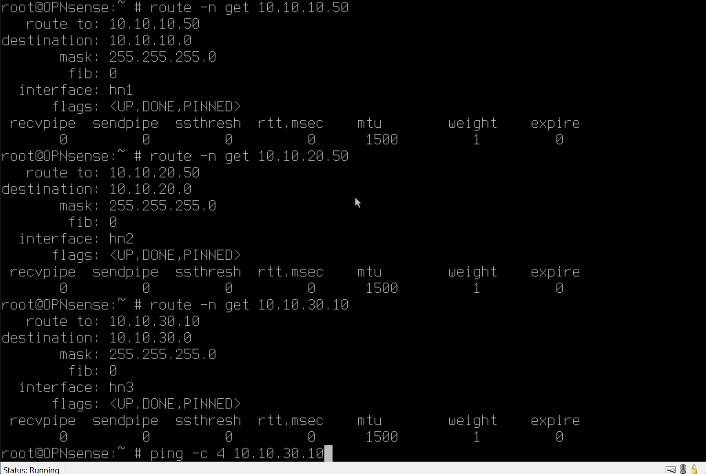
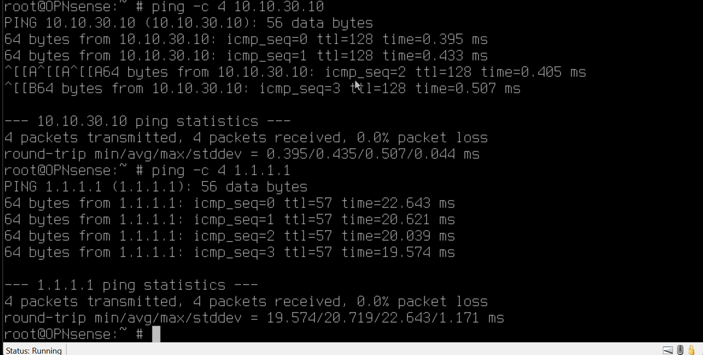
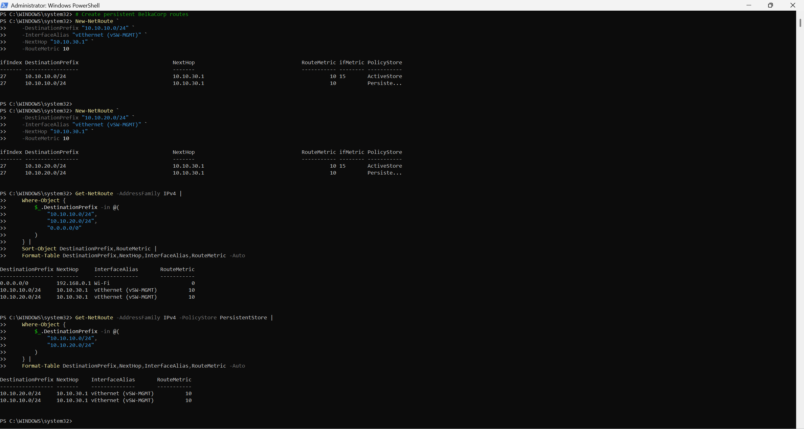
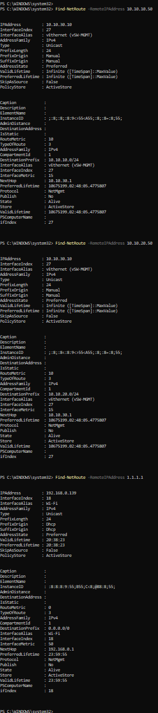
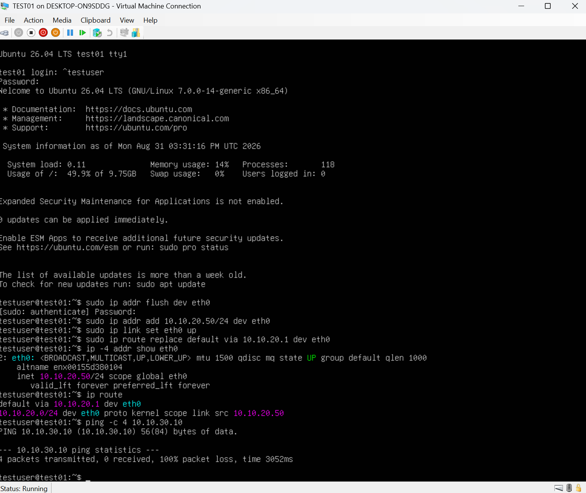
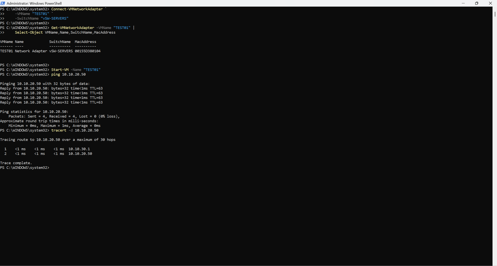

# Chapter 3 — Firewall and Routing

## Goal

I am deploying `FW01` as the Layer-3 router and firewall for the BelkaCorp lab. The objective is to connect the isolated USERS, SERVERS, and MGMT networks through a controlled routing point while preserving the Windows host's normal Internet path separately.

## Why This Matters in a Company

A router/firewall is a control point between network segments. Interface identity, IP addressing, routing, and security policy must be verified independently. I therefore build `FW01` in checkpoints and only move forward after each state is technically verified and documented.

## Chapter 3 Plan

- [x] 3.1 — Verify the pre-deployment Hyper-V baseline and OPNsense installer
- [x] 3.2 — Create and verify `FW01` before first boot
- [x] 3.3 — Install OPNsense
- [x] 3.4 — Identify and map the four interfaces
- [x] 3.5 — Configure USERS, SERVERS, and MGMT gateway interfaces
- [x] 3.6 — Verify management connectivity and routing foundation
- [x] 3.7 — Add the Windows host's specific BelkaCorp routes
- [ ] 3.8 — Validate routed traffic and initial firewall behavior
- [ ] 3.9 — Complete the Chapter 3 audit

## 3.1 — Pre-Deployment Baseline and Installer Verification

Before deploying the firewall I verified the expected Hyper-V switch inventory:

```text
Default Switch  Internal
vSW-MGMT        Internal
vSW-SERVERS     Private
vSW-USERS       Private
```

I downloaded the OPNsense 26.7 `amd64` DVD image and verified the compressed download with SHA-256 before extraction.

```text
95CAFEDDA6D5B22CE832E249DC2309110FBEE19F813AD78CF28BB3D387186BFB
```

The extracted installer was staged at:

```text
C:\Hyper-V\ISOs\OPNsense-26.7-dvd-amd64.iso
```

### Evidence


## 3.2 — FW01 VM Creation and Pre-Boot Verification

I created `FW01` as a Generation 2 Hyper-V VM with a dedicated VHDX. The initial audit exposed settings that did not match the intended firewall design, so I corrected them before first boot.

Final verified platform state:

```text
Generation               2
Automatic checkpoints    Disabled
vCPU                     2
Dynamic Memory           Disabled
Startup memory           4096 MB
Secure Boot              Off
VHDX                     C:\Hyper-V\BelkaCorp\Virtual Hard Disks\FW01.vhdx
Installer ISO            C:\Hyper-V\ISOs\OPNsense-26.7-dvd-amd64.iso

WAN      -> Default Switch
USERS    -> vSW-USERS
SERVERS  -> vSW-SERVERS
MGMT     -> vSW-MGMT
```

Before the VM's first boot the dynamically assigned Hyper-V MAC addresses still appeared as zero values. I therefore treated the switch attachment as verified but deferred guest-side interface identity until the VM had run.

### Evidence


## 3.3 — Install OPNsense

I booted the verified OPNsense installation media, entered the installer, kept the default keymap, selected ZFS with a single-disk stripe, selected `da0`, and installed OPNsense to the dedicated `FW01.vhdx` virtual disk. I set the root password during installation but do not store credentials in the repository.

After installation I halted the VM and detached the installer ISO. The first post-install start unexpectedly fell through to Hyper-V PXE instead of booting the installed system.

I verified that:

```text
FW01.vhdx     attached on SCSI 0:0
Secure Boot   Off
Installer ISO detached
```

I then explicitly placed `FW01.vhdx` first in the Generation 2 firmware boot order. On the controlled retry OPNsense booted successfully from the installed disk and reached the normal console menu.

The incident is documented separately in `../troubleshooting/006-fw01-post-install-pxe-boot.md`.

### Evidence


## 3.4 — Identify and Map the Four Interfaces

I did not assume that OPNsense's guest interface order matched the Hyper-V adapter order. I first collected the authoritative Hyper-V adapter names, switches, and MAC addresses:

```text
WAN      Default Switch   00:15:5D:38:01:05
USERS    vSW-USERS        00:15:5D:38:01:06
SERVERS  vSW-SERVERS      00:15:5D:38:01:07
MGMT     vSW-MGMT         00:15:5D:38:01:08
```

From the OPNsense shell I queried the MAC address of each Hyper-V synthetic NIC:

```text
hn0   00:15:5D:38:01:05
hn1   00:15:5D:38:01:06
hn2   00:15:5D:38:01:07
hn3   00:15:5D:38:01:08
```

Matching identical MAC addresses proved the exact guest mapping:

```text
WAN      -> hn0 -> Default Switch
USERS    -> hn1 -> vSW-USERS
SERVERS  -> hn2 -> vSW-SERVERS
MGMT     -> hn3 -> vSW-MGMT
```

I then applied the OPNsense roles as:

```text
WAN   = hn0
LAN   = hn3   [BelkaCorp MGMT]
OPT1  = hn1   [BelkaCorp USERS]
OPT2  = hn2   [BelkaCorp SERVERS]
```

I intentionally use OPNsense's built-in `LAN` role for the trusted management network. I did not configure LAGGs because the four virtual NICs have separate network roles rather than forming one aggregated link.

### Evidence


## 3.5 — Configure Internal Gateway Interfaces

I configured the three static BelkaCorp gateway addresses:

```text
USERS    OPT1 / hn1   10.10.10.1/24
SERVERS  OPT2 / hn2   10.10.20.1/24
MGMT     LAN  / hn3   10.10.30.1/24
WAN      WAN  / hn0   DHCP through Hyper-V Default Switch
```

I did not configure an upstream gateway on any internal interface because `FW01` itself is the gateway for hosts on those directly connected networks. I also kept OPNsense DHCP disabled because the long-term design assigns DHCP ownership to `DC01`.

I configured MGMT first and verified the path from the Windows host at `10.10.30.10/24`:

```text
Windows -> 10.10.30.1 ICMP   4/4 replies, 0% loss
OPNsense HTTPS Web GUI       reachable at https://10.10.30.1
```

After that verification I configured USERS and SERVERS. The console then showed all three static internal gateway addresses at once.

The WAN lease is dynamic because it is supplied by the Hyper-V Default Switch, so its exact address may change without altering the BelkaCorp internal design.

### Evidence


## 3.6 — Verify Management Connectivity and Routing Foundation

With all three internal interfaces addressed, I inspected OPNsense's IPv4 routing table rather than assuming routing was correct simply because the interfaces had IP addresses.

The routing table showed:

```text
Destination       Type / next hop        Interface
-------------------------------------------------
10.10.10.0/24     directly connected     hn1
10.10.20.0/24     directly connected     hn2
10.10.30.0/24     directly connected     hn3
default           upstream WAN gateway   hn0
```

These internal routes were created automatically because FW01 owns an address inside each `/24`. I did not manually add those connected routes.

I then performed explicit route lookups for representative internal destinations:

```text
route to 10.10.10.50 -> interface hn1
route to 10.10.20.50 -> interface hn2
route to 10.10.30.10 -> interface hn3
```

The `.50` destinations do not need to exist. The purpose of those commands is to ask the routing table which interface would be selected for traffic to each subnet.

Finally, I validated actual IP connectivity from FW01:

```text
FW01 -> Windows host 10.10.30.10   4/4 replies, 0% loss
FW01 -> public IP 1.1.1.1          4/4 replies, 0% loss
```

This verifies both the management-side path and WAN IP connectivity at this checkpoint. Routing does **not** mean all cross-subnet traffic is permitted; firewall policy is a separate decision.

### Evidence






## 3.7 — Add Windows Host BelkaCorp Routes

Before adding routes, I verified that the Windows MGMT adapter was connected with DHCP disabled, that the normal Windows default route still used Wi-Fi through `192.168.0.1`, and that no routes for USERS or SERVERS already existed.

I then added these two routes through the reachable FW01 MGMT interface:

```text
10.10.10.0/24 -> 10.10.30.1 via vEthernet (vSW-MGMT)
10.10.20.0/24 -> 10.10.30.1 via vEthernet (vSW-MGMT)
```

I used route metric `10` for both. Windows created the routes in the active routing table and persisted them for future boots. I verified the persistent store separately rather than assuming persistence from the creation command.

The resulting routing model is:

```text
0.0.0.0/0       -> 192.168.0.1 -> Wi-Fi
10.10.10.0/24   -> 10.10.30.1  -> vEthernet (vSW-MGMT)
10.10.20.0/24   -> 10.10.30.1  -> vEthernet (vSW-MGMT)
```

I then used `Find-NetRoute` to verify Windows' actual route selection:

```text
10.10.10.50 -> vEthernet (vSW-MGMT), next hop 10.10.30.1
10.10.20.50 -> vEthernet (vSW-MGMT), next hop 10.10.30.1
1.1.1.1     -> Wi-Fi, next hop 192.168.0.1
```

This confirms that only the two BelkaCorp destination networks are diverted through FW01 while ordinary Internet traffic keeps using the Windows host's existing Wi-Fi default route.

### Evidence





This completes Step 3.7.

## 3.8 — Validate Routed Traffic and Initial Firewall Behavior

To test real forwarding instead of only inspecting routing tables, I temporarily moved `TEST01` from `vSW-MGMT` to `vSW-SERVERS`. I did not change its persistent Netplan configuration. I replaced only the live Linux network state with:

```text
TEST01 eth0       10.10.20.50/24
Default gateway   10.10.20.1
Hyper-V switch    vSW-SERVERS
```

This created a real endpoint on the SERVERS network while preserving the original TEST01 configuration for later restoration.

From the Windows MGMT host at `10.10.30.10`, I then tested `10.10.20.50`. The ping returned 4/4 replies with 0% loss. `tracert -d` showed:

```text
hop 1   10.10.30.1   FW01 MGMT
hop 2   10.10.20.50  TEST01 SERVERS
```

This is direct evidence that FW01 is forwarding traffic between different BelkaCorp subnets. It proves more than the earlier route-table checks because an actual packet crossed the router from MGMT to SERVERS and received a valid return path.

I then initiated a new connection in the opposite direction from TEST01 on SERVERS to the Windows MGMT host:

```text
TEST01 10.10.20.50 -> 10.10.30.10
4 packets transmitted, 0 received, 100% loss
```

The failed reverse-direction ping is recorded as an observation, not yet as proof of the exact blocking component. The routing path exists, but the next checkpoint is to inspect the OPNsense live firewall log during the failed attempt and confirm whether the packet is being denied by the SERVERS/OPT2 policy.

### Evidence





Step 3.8 remains in progress until the firewall decision for the failed SERVERS-to-MGMT connection is directly observed and documented.

## Evidence and Documentation Workflow

I complete repository work at the same meaningful checkpoint as the technical work:

```text
IMPLEMENT
   |
   v
VERIFY
   |
   v
CAPTURE USEFUL EVIDENCE
   |
   v
STORE + VERIFY IN GITHUB
   |
   v
UPDATE DOCUMENTATION
   |
   v
CONTINUE
```

## Current Position

**Step 3.7 is complete and Step 3.8 is in progress.** Real MGMT-to-SERVERS forwarding is verified using TEST01 temporarily at `10.10.20.50/24`: Windows received 4/4 replies and traceroute showed FW01 `10.10.30.1` as the intermediate hop. A new SERVERS-to-MGMT ping from TEST01 failed with 100% loss. The next action is to reproduce that failed attempt while viewing OPNsense's live firewall log so the policy decision can be attributed from direct evidence rather than assumption.
