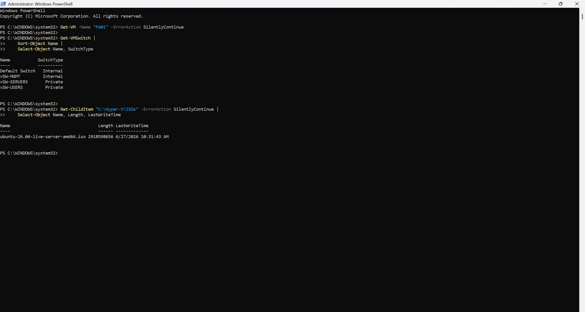
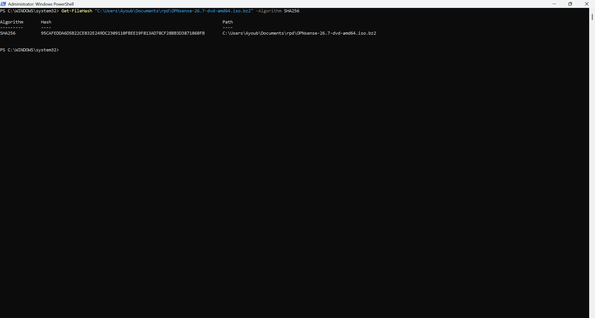
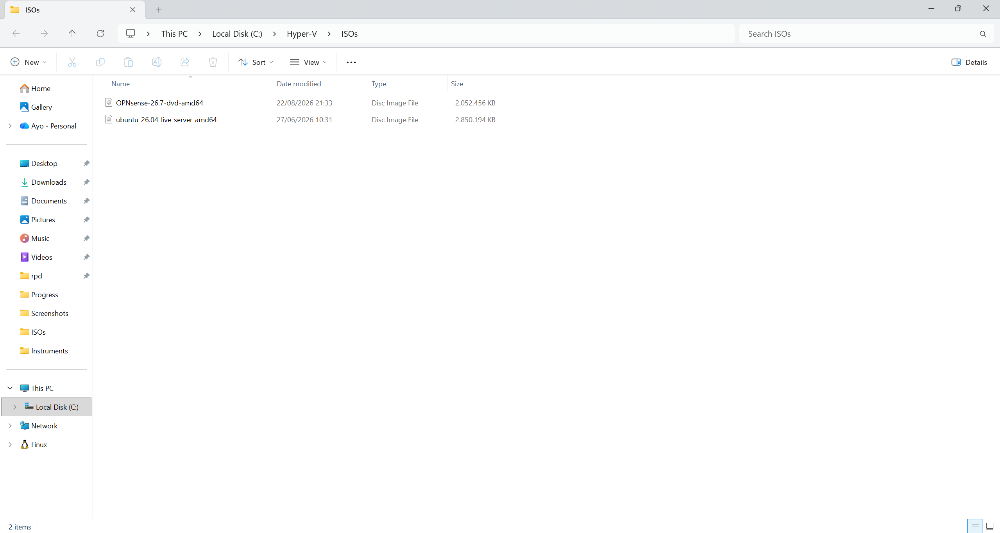
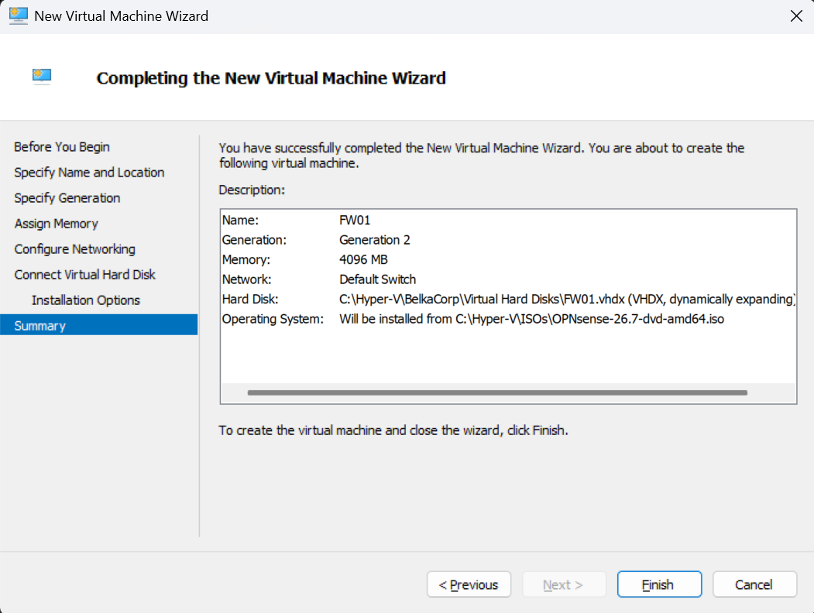
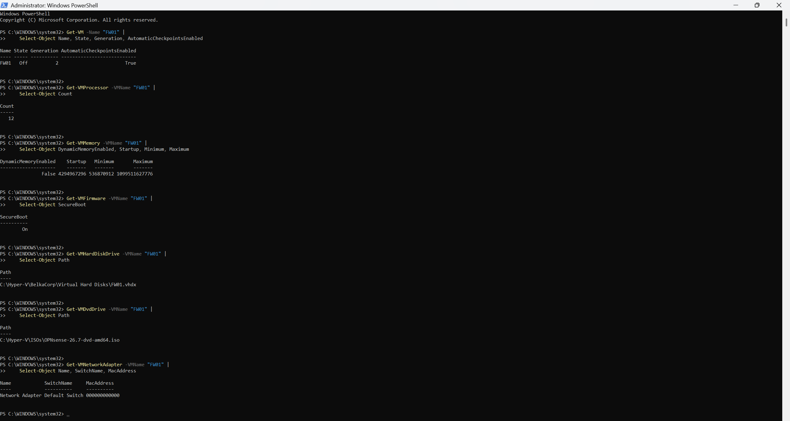
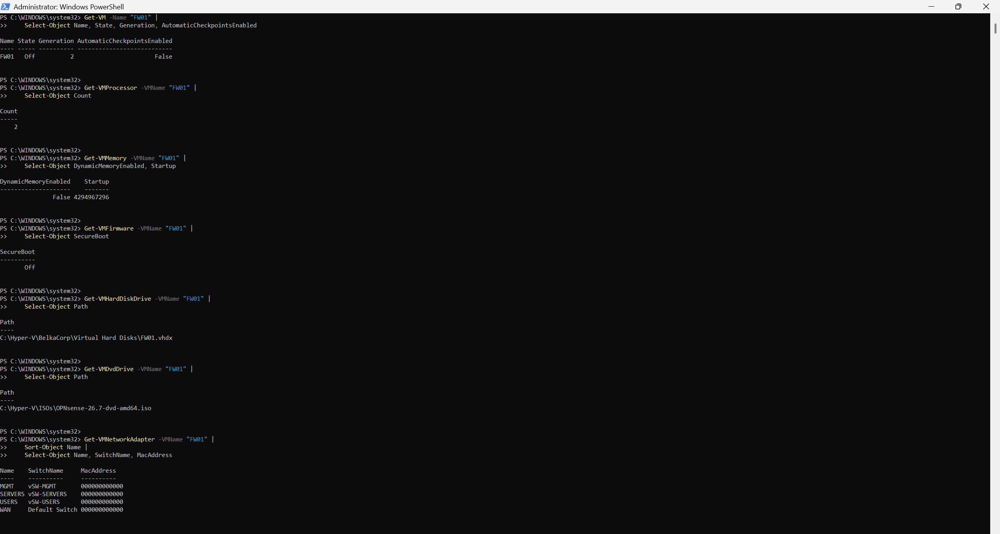
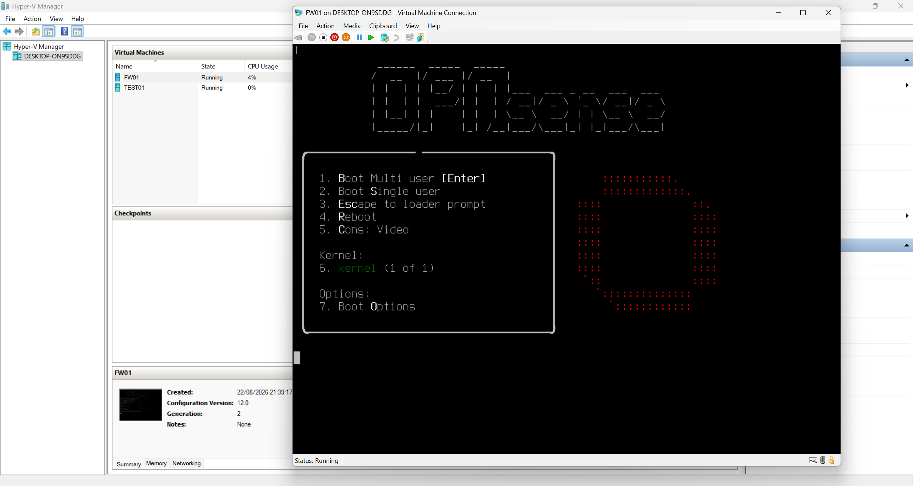

# Chapter 3 — Firewall and Routing

## Goal

I am deploying `FW01` as the Layer-3 router and firewall for the BelkaCorp lab. The immediate objective is to turn the three isolated Hyper-V networks from Chapter 2 into routed networks while preserving clear security boundaries and keeping the Windows host's normal Internet route separate from the lab.

## Why This Matters in a Company

A firewall/router is the control point between network segments. It must have the correct interfaces, addresses, routes, and policy before servers and clients can reliably communicate across subnets. I am therefore building and verifying `FW01` in stages rather than assigning routes or deploying later services before the router actually exists.

## Chapter 3 Plan

- [x] 3.1 — Verify the pre-deployment Hyper-V baseline and OPNsense installer
- [x] 3.2 — Create and verify the `FW01` VM before first boot
- [ ] 3.3 — Install OPNsense
- [ ] 3.4 — Identify and map the four interfaces
- [ ] 3.5 — Configure USERS, SERVERS, and MGMT gateway interfaces
- [ ] 3.6 — Verify management connectivity and routing foundation
- [ ] 3.7 — Add the Windows host's specific BelkaCorp routes
- [ ] 3.8 — Validate routed traffic and initial firewall behavior
- [ ] 3.9 — Complete the Chapter 3 audit

## 3.1 — Pre-Deployment Baseline and Installer Verification

Before creating the firewall VM, I verified that no existing `FW01` VM was present and confirmed the expected Hyper-V switch inventory:

```text
Default Switch  Internal
vSW-MGMT        Internal
vSW-SERVERS     Private
vSW-USERS       Private
```

At that point, the Hyper-V ISO directory contained only the existing Ubuntu Server installer, so the OPNsense installer still had to be added.

I downloaded the OPNsense 26.7 DVD image for `amd64` and verified the compressed installer with SHA-256 before extraction. The calculated hash matched the expected release hash:

```text
95CAFEDDA6D5B22CE832E249DC2309110FBEE19F813AD78CF28BB3D387186BFB
```

I then extracted the ISO and staged it at:

```text
C:\Hyper-V\ISOs\OPNsense-26.7-dvd-amd64.iso
```

### Evidence







## 3.2 — FW01 VM Creation and Pre-Boot Verification

I used the Hyper-V New Virtual Machine Wizard to create the initial `FW01` VM shell with:

```text
Name             FW01
Generation       2
Startup memory   4096 MB
Initial network  Default Switch
Virtual disk     C:\Hyper-V\BelkaCorp\Virtual Hard Disks\FW01.vhdx
Disk type        dynamically expanding VHDX
Installer        C:\Hyper-V\ISOs\OPNsense-26.7-dvd-amd64.iso
```

### Wizard Evidence



### Initial PowerShell Audit

I inspected the actual Hyper-V VM object before first boot instead of assuming the wizard defaults matched the intended firewall design.

The initial audit showed:

```text
State                    Off
Generation               2
Automatic checkpoints    Enabled
vCPU                     12
Dynamic Memory           Disabled
Startup memory           4096 MB
Secure Boot              Enabled
VHDX                     C:\Hyper-V\BelkaCorp\Virtual Hard Disks\FW01.vhdx
DVD                       C:\Hyper-V\ISOs\OPNsense-26.7-dvd-amd64.iso
Network adapters          1
Initial switch            Default Switch
```

The fixed 4096 MB memory policy, virtual disk path, installer path, VM generation, and powered-off state were already correct. The displayed minimum/maximum memory values were not active limits because Dynamic Memory was disabled.

The audit exposed four settings that required correction:

```text
12 vCPU                  -> 2 vCPU
Automatic checkpoints   -> Disabled
Secure Boot              -> Disabled
1 network adapter        -> 4 total adapters
```

### Evidence



### Pre-Boot Remediation

While `FW01` remained powered off, I changed the processor count to 2, disabled automatic checkpoints, disabled Secure Boot, renamed the existing Default Switch adapter to `WAN`, and added the three internal adapters.

The intended adapter mapping is now implemented at the Hyper-V layer:

```text
WAN      -> Default Switch
USERS    -> vSW-USERS
SERVERS  -> vSW-SERVERS
MGMT     -> vSW-MGMT
```

### Final Pre-Boot Verification

A clean PowerShell verification confirmed:

```text
State                    Off
Generation               2
Automatic checkpoints    Disabled
vCPU                     2
Dynamic Memory           Disabled
Startup memory           4096 MB
Secure Boot              Off
VHDX                     C:\Hyper-V\BelkaCorp\Virtual Hard Disks\FW01.vhdx
DVD                       C:\Hyper-V\ISOs\OPNsense-26.7-dvd-amd64.iso

MGMT      -> vSW-MGMT
SERVERS   -> vSW-SERVERS
USERS     -> vSW-USERS
WAN       -> Default Switch
```

The adapters still displayed `000000000000` before the first boot because Hyper-V had not yet assigned their dynamic MAC addresses. That did not invalidate the switch mapping.

### Evidence



I did not add the Windows host's routes to `10.10.10.0/24` or `10.10.20.0/24`, because `10.10.30.1` was not yet a configured, verified next hop.

## 3.3 — Install OPNsense

### First Boot from the Installer ISO

I started `FW01` for the first time with the verified OPNsense ISO still attached. Hyper-V showed the VM in a running state and the console reached the OPNsense boot menu, confirming that the Generation 2 VM can boot the installer successfully with Secure Boot disabled.

I continued with the default multi-user boot. OPNsense completed the live-environment startup and reached the console login prompt. The installation to `FW01.vhdx` has not started yet.

### Evidence



This screenshot proves the first successful boot from the OPNsense installation media and shows `FW01` running in Hyper-V.

## Evidence and Documentation Workflow

I complete repository work at the same meaningful checkpoint as the technical work:

```text
IMPLEMENT
   |
   v
VERIFY
   |
   v
CAPTURE USEFUL EVIDENCE
   |
   v
STORE + VERIFY IN GITHUB
   |
   v
UPDATE DOCUMENTATION
   |
   v
CONTINUE
```

This prevents the repository from lagging behind the real infrastructure state.

## Current Position

**Step 3.2 is complete and Step 3.3 is in progress.** `FW01` has successfully booted from the OPNsense ISO and the live environment has reached the login prompt. The next action is to enter the installer workflow and install OPNsense to `FW01.vhdx`. I will verify the installed system boots from the virtual disk before moving to **3.4 — Identify and map the four interfaces**.